# Streamable TTS API

Streaming text-to-speech and voice conversion. Text in, 24 kHz audio out, first byte in ~100 ms.

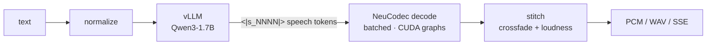

Two services, one GPU each:

| service | port | does |
|---|---|---|
| **vLLM** | `:9093` | text → speech tokens. Not the bottleneck. |
| **this app** | `:9091` | speech tokens → audio. Is the bottleneck. |

| | |
|---|---|
| TTFB | ~100 ms on-box, ~230 ms through a LiveKit agent (the agent costs a flat +130 ms) |
| Throughput | ~200 audio-s/s at concurrency 32 |
| RTF | 0.10 single-stream, 0.15 at concurrency 32 |

## Reports

Every number in this README comes from one of these. Each is self-contained.

| report | one line |
|---|---|
| [INVESTIGATION.md](bench/INVESTIGATION.md) | **Start here.** A demo complaint → six measurements → three fixes, in diagrams |
| [PLAYBACK_SPEED.md](bench/PLAYBACK_SPEED.md) | `playback_speed` 0.1→2.0. **Use 0.4**: 32% faster TTFB, smoother chunks |
| [PADDING_BUG.md](bench/PADDING_BUG.md) | The batcher padded windows and corrupted audio. Fixed. Why fp16/int8/bf16 all fail |
| [TTFB.md](bench/TTFB.md) | TTFB, end-to-end, RTF percentiles. The TP=1/2/4 sweep |
| [MEGAKERNEL.md](bench/MEGAKERNEL.md) | `torch.compile` fusion: up to 2.27× per decode, but ~10 s per new shape. Not enabled |
| [LIVEKIT.md](bench/LIVEKIT.md) | Through a real agent: +130 ms flat, 0 errors to 16 rooms, and two rig traps |
| [PITCH_TONE_AB.md](bench/PITCH_TONE_AB.md) | "Loud and excited mid-sentence": which half is LiveKit, which is the model |
| [INTERLEAVE_AB.md](bench/INTERLEAVE_AB.md) | `interleave_id` cuts the chunk-join jump ~25% |
| [NORMALIZER.md](bench/NORMALIZER.md) | Rule vs LLM text normalization, 497 sentences |
| [WIDECODEC_AB.md](bench/WIDECODEC_AB.md) | NeuCodec vs WideCodec. Verdict: keep NeuCodec |
| [OPTIMIZATION.md](bench/OPTIMIZATION.md) | Where the time goes, and which knobs move it |
| [WEDGE_TEST.md](bench/WEDGE_TEST.md) | Wedge/disconnect handling under a stalled client |
| [bench/livekit/](bench/livekit/) | LiveKit agent stress rig — TTFB and loudness through real WebRTC |
| [bench/interleave_ab/](bench/interleave_ab/) | The interleave A/B harness (corpus, generate, score) |
| [bench/widecodec_ab/](bench/widecodec_ab/) | Codec A/B harness — one token stream, two decoders |
| [bench/multilingual_normalizer/](bench/multilingual_normalizer/) | 16-locale written→spoken dataset generator |
| [bench/synth/](bench/synth/) | Render a sentence file through N checkpoints |

### Latency


TTFB p50 **102 ms** single-stream, **195 ms** at concurrency 32. RTF p50 0.096 → 0.152.
Details: [TTFB.md](bench/TTFB.md).

### Where it saturates


The codec GPU is the only resource that climbs with load. It reaches 96% at 6% memory
bandwidth — launch-bound, not bandwidth-bound.

### Decode correctness

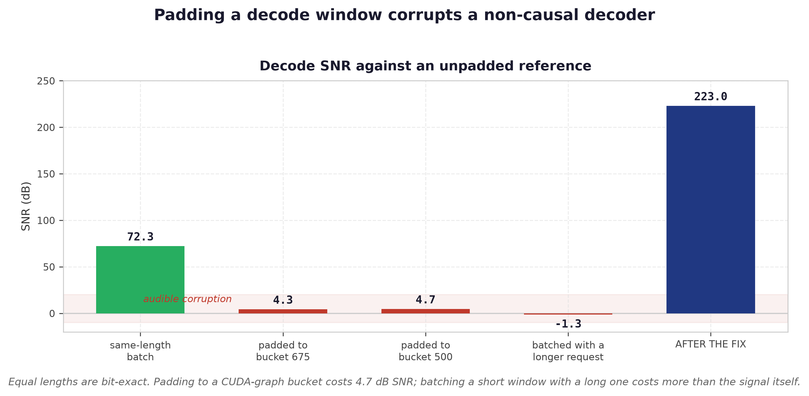

The batcher padded windows with token id 0. A non-causal decoder mixes that into the audio
it keeps. Fixed 2026-09-22. Details: [PADDING_BUG.md](bench/PADDING_BUG.md).

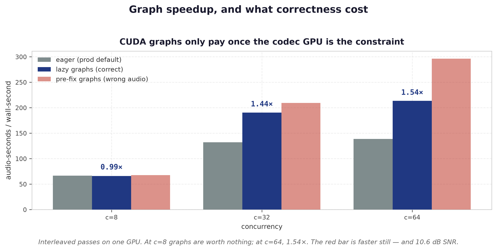

### Precision and quantization

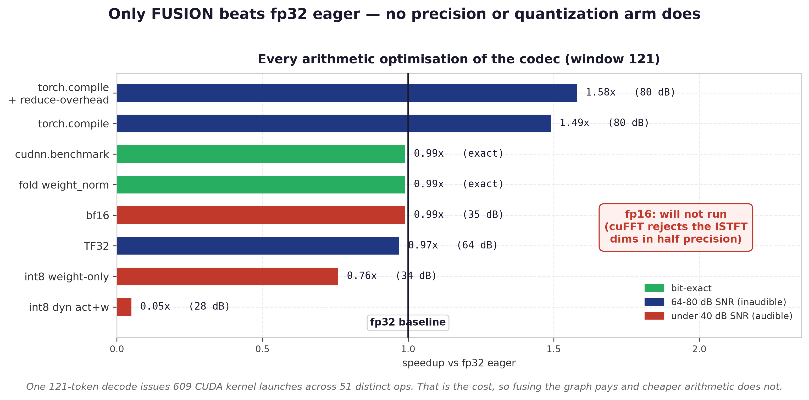

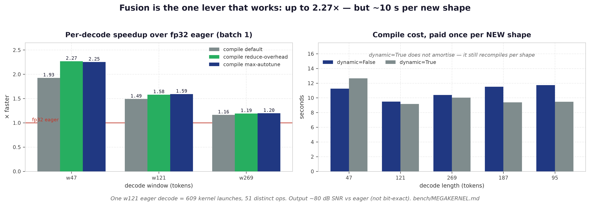

Fusion is the only lever that beats fp32 eager — the decoder is launch-bound (609 kernels per
decode). Blocked by a ~10 s compile per new window length. Full report: [MEGAKERNEL.md](bench/MEGAKERNEL.md).

fp16 cannot run — cuFFT rejects the ISTFT dims in half precision. Nothing else beats fp32.

### LiveKit

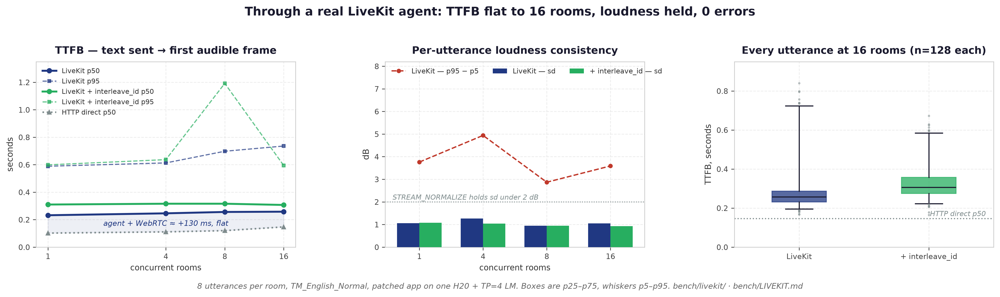

TTFB is flat from 1 to 16 rooms (0.232 → 0.258 s) and the agent + WebRTC tax is a constant
**+111 to +136 ms**, not a slope — so a LiveKit TTFB regression is almost never LiveKit.
0 errors in 688 utterances; loudness sd stays 0.92–1.26 dB. `interleave_id` costs ~64 ms
and shrinks under load. Full report: [LIVEKIT.md](bench/LIVEKIT.md).

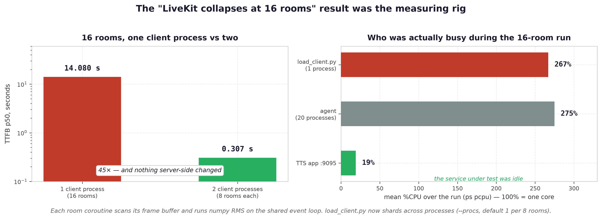

The first 16-room run reported an 8.4 s TTFB cliff. It was the load client: one python
process cannot drive more than ~8 rooms, and its own scheduling delay is charged to the
server. Split over two processes, the same 16 rooms returned **0.307 s**.

### Pitch and tone


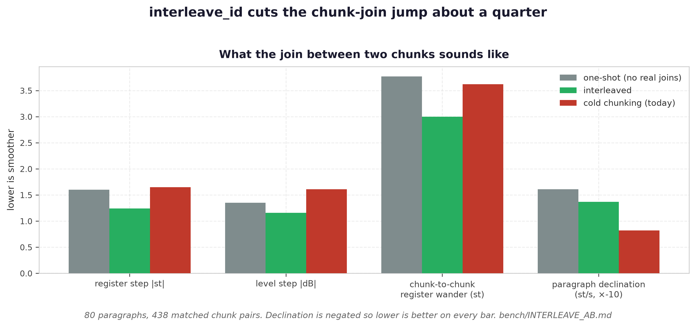

### Text normalization

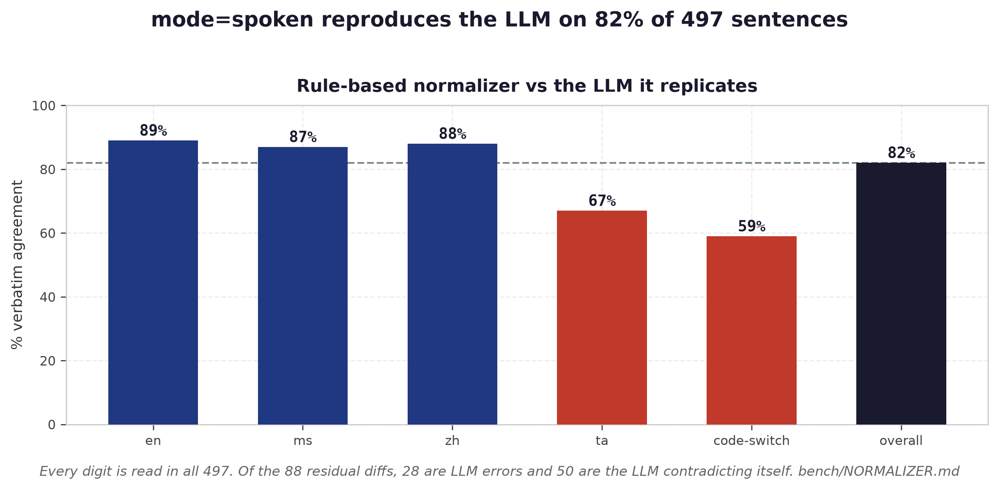

### Codec choice

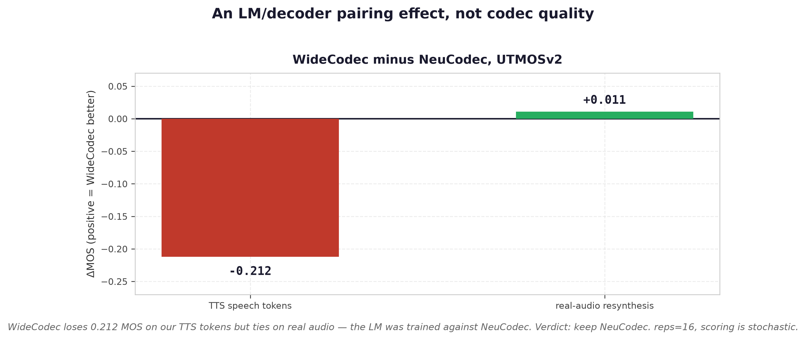

### First decode window


`0.4` gives TTFB 70 ms against 0.75's 103 ms, with loudness, pitch and MOS unchanged within noise.
⚠ Client buffer falls to **30 ms at concurrency 32** (0.75 keeps 390 ms) while the TTFB win shrinks
to 11%. Use 0.4 at low concurrency; keep 0.75 near 32.
Details: [PLAYBACK_SPEED.md](bench/PLAYBACK_SPEED.md).

All figures: `bench/plots/make_figures.py`.

## Setup

### 1. Start vLLM backend

```bash
TTS_MODEL=Scicom-intl/Multilingual-Expressive-TTS-1.7B GPU_MEM_UTIL=0.7 \
docker compose -f vllm.yaml up --detach
```

Set `TTS_API=http://tts-engine:9093` in your [.env](.env) to point to the vLLM backend.

### 2. Configure environment

Copy [.env_example](.env_example) to `.env` and adjust as needed. See [app/env.py](app/env.py) for all available variables:

| Variable | Default | Description |
|---|---|---|
| `TTS_API` | `http://tts-engine:9093` | vLLM backend URL |
| `TTS_API_KEY` | ` ` | Bearer token sent to the vLLM backend when set |
| `MODEL_NAME` | `TTS-model` | Model identifier |
| `DEVICE` | ` ` (auto) | Codec decode device: empty = cuda→npu→cpu autodetect, or force `npu`/`cpu` |
| `DEFAULT_SPEAKER` | see [app/env.py](app/env.py) | Default voice |
| `SPEAKERS` | see [app/env.py](app/env.py) | Available voices (comma-separated) |
| `DEFAULT_TEMPERATURE` | `0.6` | Sampling temperature |
| `DEFAULT_REPETITION_PENALTY` | `1.15` | Repetition penalty |
| `DEFAULT_MAX_TOKENS` | `3072` | Max output tokens |
| `DEFAULT_PLAYBACK_SPEED` | `2.0` | First decode window in seconds ×50 tokens (2.0 ⇒ 100 tokens = 2 s). The first audio byte waits for this many tokens (+ overlap) from the LM, so it is the TTFB knob: 2.0 ⇒ ~220 ms, 1.5 ⇒ ~170 ms, 0.75 ⇒ ~100 ms at 530 tok/s; 0.75 was verified transcript-identical to a one-shot decode, 0.5 skews the loudness normalizer +1 dB (see [CLAUDE.md](CLAUDE.md), *Time to first byte*) |
| `STREAM_CHUNK_GROWTH` | `2.0` | Each later decode window grows by this factor (1.0 = fixed windows) |
| `STREAM_MAX_CHUNK_S` | `10.0` | Cap on grown decode windows (seconds) |
| `STREAM_PAST_CONTEXT_S` | `3.0` | Past tokens included in every decode window then sliced off (no latency cost; pulls windowed decode toward one-shot) |
| `DEFAULT_PLAYBACK_OVERLAP_SPEED` | `0.2` | Overlap speed for crossfading |
| `DEFAULT_SPEAKING_RATE` | `1.0` | Default speaking rate (`speaking_rate` request field): 1.3 = 30% faster, 0.8 = slower, pitch preserved (WSOLA time stretch on the decoded audio, see below) |
| `DEFAULT_NORMALIZE_MALAYSIAN` | `false` | Default for the `normalize_malaysian` request field |
| `DEFAULT_NORMALIZER_MODE` | `rule` | Default for the `mode` request field: `rule` (legacy pipeline), `llm`, or `spoken` (rule-based replica of the LLM normalizer, see below) |
| `STREAM_CROSSFADE` | `true` | Context-primed windows + raised-cosine crossfade at chunk boundaries (removes the boundary click; `false` = legacy hard cut) |
| `CROSSFADE_MS` | `12.0` | Crossfade blend width in ms |
| `STREAM_NORMALIZE` | `true` | Loudness-normalize streamed audio toward `TARGET_RMS_DB` (running per-utterance estimate; kills the 3–10 dB run-to-run LM loudness variance and full-scale clipping) |
| `TARGET_RMS_DB` | `-16.0` | Target active-speech RMS (dBFS) when `STREAM_NORMALIZE` is on |
| `MAX_GAIN_DB` / `GAIN_SLEW_DB` | `12` / `1` | Gain clamp and max gain change per chunk |
| `DYNAMIC_BATCHING` | `true` | Batch concurrent decode calls (free at concurrency 1) |
| `MICROSLEEP` | `1e-4` | Batch collection interval (seconds) |
| `MAX_BATCH_SIZE` | `16` | Max requests per batch |
| `CUDA_GRAPH_BATCH` | `[]` (eager) | CUDA graph token-length buckets (seconds ×50). Must cover grown windows (`STREAM_MAX_CHUNK_S`+`STREAM_PAST_CONTEXT_S` ≈ 13.5 s) or oversize decodes fall back to eager, e.g. `[0.5, 1.0, 1.5, 2.0, 3.0, 4.0, 6.0, 10.0, 13.5]` |
| `TORCH_COMPILE` | `false` | Use torch.compile instead of CUDA Graphs |
| `DEBUG_AUDIO` | `false` | Save intermediate audio chunks to disk |
| `SENTRY_DSN` | ` ` | Sentry DSN for error tracking |
| `ENABLE_TRACING_SPANS` | `true` | Hot-path spans: dynamic-batch wait, vLLM wait, codec decode. **Also needs an exporter configured** (`OTLP_ENDPOINT` etc.) or spans are not built at all. See [Tracing](#tracing-loki--tempo) |
| `TRACING_SPANS_REQUIRE_EXPORTER` | `true` | The gate above. Set `false` only when a span processor is installed in code rather than via environment |
| `TRACE_ASGI_MESSAGE_SPANS` | `false` | Keep the OTel ASGI `http receive`/`http send` span per ASGI message. Off because streaming made it ~500 empty spans per request |
| `DISCONNECT_POLL_S` | `0.25` | How often the LM reader may ask whether the client disconnected (each check is a real ASGI receive) |
| `OTLP_ENDPOINT` | ` ` | Tempo OTLP endpoint for traces (e.g. `http://localhost:4317`). Handled by `wan` |
| `SERVICE_NAME` | `fastapi` | Service name on spans and logs. Handled by `wan` |
| `TRACING_SAMPLE` | `1.0` | Head sampling ratio; drop below 1.0 before enabling spans under load |
| `OPENAI_BASE_URL` | ` ` | OpenAI-compatible endpoint for the LLM normalizer (`mode: "llm"`). Empty = llm mode disabled |
| `OPENAI_API_KEY` | ` ` | API key for `OPENAI_BASE_URL` |
| `OPENAI_MODEL_NAME` | ` ` | Model to use on `OPENAI_BASE_URL` (e.g. `google/gemma-4-31b-it`). **Not** `MODEL_NAME`, which is the TTS model |
| `OPENAI_TIMEOUT` | `10` | LLM normalizer request timeout (seconds); bounds the TTS stall before rule-based fallback |
| `LLM_NORMALIZER_SKIP_PLAIN` | `true` | Skip the LLM normalizer call (~0.55 s, all of it before the first audio byte) when the text has nothing to normalize: no digit, symbol, ALL-CAPS/dotted token or known abbreviation (`needs_normalization` in `app/llm_normalizer.py`). Output is identical either way (verified 51/51 sentences against the live LLM, `bench/normalizer_gate_eval.py`); `false` = always call |
| `LLM_NORMALIZER_RULE_FIRST` | `false` | In `mode=llm`, run the `spoken` rules first and only call the LLM when they left something unspeakable behind (a digit, a symbol, a dotted token). Removes the ~0.55 s LLM round trip from TTFB on practically every request; off by default because it changes the output on the ~14% of sentences where the two differ |

### 3. Run the API

**GPU:**

```bash
docker compose up --build
```

**CPU:**

```bash
docker compose -f docker-compose-cpu.yaml up --build
```

## Tracing (Loki + Tempo)

The app calls [`wan.patch()`](https://github.com/Scicom-AI-Enterprise-Organization/wan) at
startup. That gives you, always:

| | |
|---|---|
| JSON logs | one line per request, carrying the trace id |
| `/metrics` | Prometheus |
| `/scalar` | API docs |
| health probes | — |

`wan` owns `SERVICE_NAME`, `OTLP_ENDPOINT`, `TRACING_SAMPLE` and the rest of the OTLP config.

`ENABLE_TRACING_SPANS` (default on) adds this repo's own hot-path spans
([app/tracing.py](app/tracing.py)). They show where a request's time went:

```
POST /v1/audio/speech                 (fastapi instrumentation)
├── tts.normalize                     normalizer.mode=rule|llm, chars in/out
│   ├── normalize.llm                 the LLM normalizer call (mode="llm")
│   └── normalize.rule                the rule-based pipeline
└── tts.stream                        tts.ttfb_s, tts.lm_wait_s, tts.decode_wait_s,
    │                                 tts.decodes, tts.chunks, tts.audio_bytes
    ├── lm.generate                   the vLLM SSE stream, lm.deltas
    │   ├── lm.connect                POST → response headers
    │   └── lm.first_token            headers → first speech token (prefill)
    ├── tts.chunk (index=0)           one emitted audio chunk
    │   └── codec.decode              codec.tokens
    │       ├── codec.batch_wait      queued → picked up by the batch collector
    │       ├── codec.batch_prep      batch formed → H2D copy issued (batch thread)
    │       ├── codec.compute_wait    H2D issued → compute thread starts
    │       └── codec.gpu_decode      graph replay + D2H, batch.size, codec.cuda_graph
    └── tts.chunk (index=1) ...
```

So: **dynamic batching** = `codec.batch_wait` + `codec.batch_prep` + `codec.compute_wait`,
**waiting on vLLM** = `lm.connect` + `lm.first_token` and the `tts.lm_wait_s` aggregate
(how long the stitcher had no tokens left to decode), **decoding speech tokens** =
`codec.gpu_decode`, or `tts.decode_wait_s` for the whole per-request wait. Voice
conversion adds `vc.load_audio`, `codec.encode`, `codec.encode_wait` and
`codec.encode_gpu`.

Two things make this safe to leave in the code path:

- **Removable, not just cheap, and off unless someone is listening.** Spans are built
  only when `ENABLE_TRACING_SPANS` is on *and* an exporter is configured *and*
  opentelemetry is importable. Fail any of the three and every helper is a shared
  `contextlib.nullcontext()` or a function returning `None` before doing anything — no
  tracer lookup, no `time_ns()`, no per-decode dict. The decode loop is GIL-bound, so
  tracing has to be genuinely absent when off.
- **Explicit parents.** A decode batch is built from N different requests, so the
  batching threads cannot use the ambient span context; each queued item carries its
  request's context plus the timestamp of the previous hop, and each stage is recorded
  after the fact with those timestamps.

Under real load, sample: `TRACING_SAMPLE=0.05` keeps the trace volume (and the ~5 extra
spans per decode) sane.

### `OTLP_ENDPOINT` is part of the switch

`ENABLE_TRACING_SPANS` on its own does nothing: with no exporter configured the hot-path
spans are **not built at all**, and the app logs why at startup rather than leaving you to
wonder where the spans went:

```
hot-path spans requested but no span exporter is configured, so they are disabled rather
than built and dropped. Set OTLP_ENDPOINT (or ENABLE_CONSOLE_SPAN_EXPORTER=true) to
collect them, or TRACING_SPANS_REQUIRE_EXPORTER=false if a processor is installed in code.
```

The reason is that an OpenTelemetry SDK with no span processor attached still *builds*
every span, stores its attributes, and then drops it. Measured over 3000 iterations of one
request's worth of spans (24 spans with the real attribute sets, Apple M-series —
indicative, not H100 numbers):

| `ENABLE_TRACING_SPANS` | exporter | per request |
|---|---|---|
| `false`, or on with no exporter | — | **2.6 µs** (the nullcontext path) |
| `true` | none attached — what this gate prevents | 292 µs, all wasted |
| `true` | `BatchSpanProcessor` | 685 µs |

Any one of these opens the gate, so a console-exporter debug session or an
auto-instrumented deployment is not silently un-traced: `OTLP_ENDPOINT`,
`OTEL_EXPORTER_OTLP_ENDPOINT`, `OTEL_EXPORTER_OTLP_TRACES_ENDPOINT`, `JAEGER_HOST`,
`ENABLE_CONSOLE_SPAN_EXPORTER=true`. If you attach a processor in code instead, set
`TRACING_SPANS_REQUIRE_EXPORTER=false`.

What you give up when no exporter is configured is the *stage-level* `spanID` on log
lines: `traceID` and the request's own `spanID` still come from the FastAPI
instrumentation (as does the `X-Trace-Id` response header), but with no hot-path spans
every line of a request carries the same span id again.

One upstream default is turned off here. The OpenTelemetry ASGI instrumentation opens a
span per ASGI *message*, and a streaming response polls the receive channel as it reads
the LM stream — measured on an H20, one request produced **505 empty
`POST /v1/audio/speech http receive` spans** next to 19 real ones, which is both useless
in the flame graph and a large multiple on Tempo's ingest. Two fixes, and the same shape
of request now emits 25 spans and **zero** ASGI-message spans:

- `DISCONNECT_POLL_S` (0.25 s) bounds how often the LM reader asks whether the client
  disconnected. Each check is a real ASGI receive, and aiohttp yields two lines per SSE
  event, so the old per-line poll cost ~2 receives per speech token — event-loop time
  spent whether or not tracing is on. This alone took 505 noise spans to 9.
- `_suppress_asgi_message_spans()` in [app/main.py](app/main.py) removes the remainder,
  including the per-chunk `http send` spans that scale with utterance length. Set
  `TRACE_ASGI_MESSAGE_SPANS=true` to get the upstream behaviour back.

```bash
# a full Tempo + Loki + Alloy + Prometheus + Grafana stack to point it at
git clone https://github.com/Scicom-AI-Enterprise-Organization/wan
docker compose -f wan/grafana/docker-compose.yaml up -d \
  tempo loki alloy prometheus grafana

# then, in .env
ENABLE_TRACING_SPANS=true
OTLP_ENDPOINT=http://localhost:4327
SERVICE_NAME=tts-api
```

`ENABLE_CONSOLE_SPAN_EXPORTER=true` prints spans to stdout instead, which is enough to
check the tree without a backend.

## API Endpoints

### `GET /v1/audio/speaker`

Returns the list of available speaker voices.

### `POST /v1/audio/normalize` — Text Normalization

Normalizes text for TTS input. Strips markdown/HTML, then normalizes with one of two engines
selected by `mode`:

- **`rule`** (default) — the built-in rule-based pipeline; optionally applies Malaysian text
  normalization (email, URL, phone, IC, money, time, units, etc.) when `normalize_malaysian` is set.
- **`llm`** — sends the text to an OpenAI-compatible LLM (`OPENAI_BASE_URL` / `OPENAI_MODEL_NAME`)
  with a multilingual few-shot prompt ([app/prompt.py](app/prompt.py)). The reply is constrained to
  `{"normalized": "..."}` via `response_format` json_schema (vLLM guided decoding), so the model can
  only return the normalized text. Returns `400` if `OPENAI_*` is not configured, `502` if the LLM
  call fails. `normalize_malaysian` is ignored in this mode.

**Parameters:**

| Field | Type | Default | Description |
|---|---|---|---|
| `input` | string | required | Text to normalize |
| `normalize_malaysian` | bool | `DEFAULT_NORMALIZE_MALAYSIAN` (`false`) | Apply Malaysian text normalization (`rule` mode only) |
| `mode` | `rule` \| `llm` \| `spoken` | `DEFAULT_NORMALIZER_MODE` (`rule`) | Normalization engine. `spoken` = rule-based replica of the LLM normalizer (English, Malay, Mandarin, Tamil), no network |

**Example:**

```bash
curl -X POST 'http://localhost:9091/v1/audio/normalize' \
  -H 'Content-Type: application/json' \
  -d '{
    "input": "**Harga** rumah RM500,000. Hubungi 012-1234567 atau email husein.zol05@gmail.com",
    "normalize_malaysian": true
  }'

# LLM-based normalization
curl -X POST 'http://localhost:9091/v1/audio/normalize' \
  -H 'Content-Type: application/json' \
  -d '{
    "input": "baki saya tinggal RM1,250.50 dan IC saya 960314875079",
    "mode": "llm"
  }'
# {"output":"baki saya tinggal seribu dua ratus lima puluh ringgit lima puluh sen dan IC saya
#   sembilan enam kosong tiga satu empat lapan tujuh lima kosong tujuh sembilan.","mode":"llm"}
```

In `llm` mode the LLM is only called when the text contains something it could rewrite (a
digit, a symbol, an ALL-CAPS or dotted token, a known abbreviation). Plain sentences such as
`"Hello there, how can I help you today?"` come back unchanged from the LLM anyway, so they
skip the ~0.55 s round trip and take the same pre/post cleanup path (`LLM_NORMALIZER_SKIP_PLAIN`,
default on). On a TTS request that round trip sits entirely in front of the first audio byte.

**`mode: "spoken"`** is a rule-based replica of the LLM normalizer (`app/spoken_normalizer/`,
pure Python, ~25 µs): numbers, money (RM/sen, dollars), IC and phone numbers digit by digit,
dates, times, percentages, decimals, ordinals, units, emails, URLs, ids and the abbreviations
the LLM expands, verbalized in the sentence's language, Malay/English by marker words, Mandarin
and Tamil by script. It was built against the LLM's own outputs on `bench/normalizer_corpus.py`
(`bench/results/normalizer_truth.jsonl`, 300 sentences) and agrees with them verbatim on 85% of
sentences (English 91%, Malay 91%, Mandarin 90%, Tamil 72%, Malay/English code-switch 67%; most of
the rest are LLM slips such as answering a Tamil sentence in English), never leaves a digit unread,
and is what `mode: "llm"` falls back to. In code-switched sentences each number is read in the
language of its neighbouring words. Coverage matrix and methodology: [bench/NORMALIZER.md](bench/NORMALIZER.md). `bench/normalizer_agreement.py` re-scores it; `bench/normalizer_truth.py` extends
the ground truth.

```bash
curl -X POST 'http://localhost:9091/v1/audio/normalize' -H 'Content-Type: application/json' \
  -d '{"input": "Your total is RM1,250.50 and the meeting is at 3pm on 12/9/2026.", "mode": "spoken"}'
# {"output":"Your total is one thousand two hundred fifty ringgit fifty sen and the meeting is at
#   three p m on the twelfth of September twenty twenty six.","mode":"spoken"}
```

### `POST /v1/audio/speech` — Text-to-Speech

What one request does:

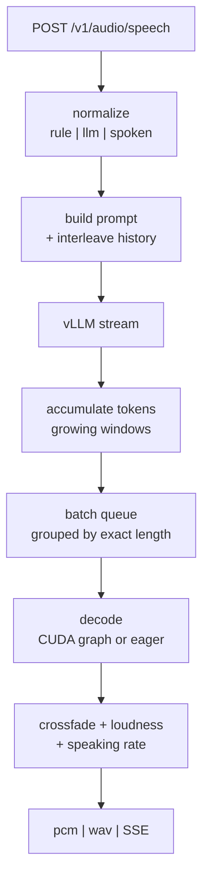

First audio leaves as soon as the first window decodes — `playback_speed × 50` tokens. That
gate is the TTFB.

Accepts a JSON body.

**Parameters:**

| Field | Type | Default | Description |
|---|---|---|---|
| `input` | string | required | Text to synthesize |
| `voice` | string | `DEFAULT_SPEAKER` | Speaker voice (list via `GET /v1/audio/speaker`) |
| `model` | string | `TTS-model` | Model name |
| `response_format` | `pcm` \| `wav` | `pcm` | Output audio format |
| `temperature` | float | `0.6` | Sampling temperature |
| `repetition_penalty` | float | `1.15` | Repetition penalty |
| `max_tokens` | int | `3072` | Max output tokens |
| `stream` | bool | `true` | Stream audio response |
| `playback_speed` | float | `2.0` | First decode window (×50 tokens; later windows grow per `STREAM_CHUNK_GROWTH`) |
| `playback_overlap_speed` | float | `0.2` | Overlap for crossfading |
| `normalize_malaysian` | bool | `DEFAULT_NORMALIZE_MALAYSIAN` (`false`) | Apply Malaysian text normalization |
| `mode` | `rule` \| `llm` \| `spoken` | `DEFAULT_NORMALIZER_MODE` (`rule`) | Normalization engine (see `/v1/audio/normalize`); `llm` falls back to `spoken` if the LLM call fails or is not configured, so speech is still produced |
| `stream_normalize` | bool | `STREAM_NORMALIZE` (`true`) | Per-utterance loudness normalization toward `TARGET_RMS_DB` |
| `speaking_rate` | float | `DEFAULT_SPEAKING_RATE` (`1.0`) | Speaking rate, `0.5`–`2.0`: `1.3` speaks 30% faster, `0.8` slower, **pitch unchanged**. Also accepted as `speed` (OpenAI-compatible clients). See [Speaking rate](#speaking-rate) |
| `interleave_id` | string | none | Interleaved generation: requests sharing this id continue each other's prosody. **Needs an interleave-trained LM — no open-source TTS model supports this.** Aliases `request_id` / `context_id`; header `X-Interleave-Id` / `X-Context-Id`. See [Interleaved generation](#interleaved-generation) |
| `max_retain_interleave` | int | `MAX_RETAIN_INTERLEAVE` (`5`) | How many previous turns of that id go into the prompt (`0` = no turn limit, seconds cap only). Same model requirement as `interleave_id` |

**Example:**

```bash
curl -X POST 'http://localhost:9091/v1/audio/speech' \
  -H 'Content-Type: application/json' \
  -d '{
    "input": "Hello! How can I help you? can I get your passport number sir.",
    "voice": "husein",
    "model": "TTS-model",
    "response_format": "wav",
    "temperature": 0.7,
    "stream": true,
    "playback_speed": 0.5,
    "playback_overlap_speed": 0.1,
    "speaking_rate": 1.2,
    "normalize_malaysian": true
  }' \
  --output output.wav
```

#### Speaking rate

`speaking_rate` (alias `speed`) changes how fast the voice talks **without changing its pitch**.
The LM has no rate control and speech tokens are a fixed 50 Hz, so this is done after NeuCodec
decode, on the PCM stream, with WSOLA (waveform-similarity overlap-add — the SoundTouch-style
tempo change, `app/timestretch.py`): the audio is copied out in ~40 ms blocks whose input hop is
`rate`× the output hop, so whole pitch periods are dropped (faster) or repeated (slower) while the
samples inside each block are untouched; each block's start is searched ±7.5 ms for the best
waveform match to the previous block's tail and the two are crossfaded over 8 ms. Plain
resampling would shorten every period too (chipmunk effect). It is a stage on the stitched stream
(after crossfade + loudness normalization, before the pcm/wav/SSE layers), stateful across
chunks with ~55 ms of lookahead — so it works for streaming, adds no measurable latency to the
2 s first chunk, and leaves the token/decode/batching pipeline untouched. `1.0` bypasses it
entirely. Range `0.5`–`2.0` (422 outside): beyond that WSOLA on speech starts to buzz / drop
consonants.

```bash
curl -X POST 'http://localhost:9091/v1/audio/speech' -H 'Content-Type: application/json' \
  -d '{"input": "Hello there, how can I help you?", "voice": "husein", "speaking_rate": 1.3,
       "response_format": "wav", "stream": false}' --output fast.wav
```

#### Interleaved generation

A streaming agent does not send a reply as one request. LiveKit's `StreamAdapter` cuts it into
sentence-sized chunks. Each chunk becomes its own `/v1/audio/speech` call.

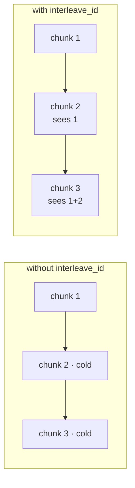

Cold means the LM picks a fresh pitch register, pace and energy at every join. Measured: it
steps **up** at two-thirds of joins. The reply sounds stitched.

Pass the same `interleave_id` on every chunk of one reply. Each request is then prompted with
the previous turns' text **and the speech tokens the LM produced for them**, in the interleaved
format the model was trained on:

```
<|im_start|>husein: hello my name is husein,<|speech_start|><|s_1834|>…<|s_77|><|im_end|>
<|im_start|>husein: i like to eat chicken rice.<|speech_start|>      ← the LM continues here
```

History is prefill only. Nothing extra is decoded or streamed, so the codec path is untouched.

| bound | default | knob |
|---|---|---|
| turns retained per id | 5 | `MAX_RETAIN_INTERLEAVE`, per-request `max_retain_interleave` |
| seconds of speech | 20 | `INTERLEAVE_MAX_S` |
| idle expiry | — | `INTERLEAVE_TTL_S` |
| storage | `/dev/shm` | shared by every uvicorn worker on the host |

A voice switch on the same id starts cold.
Design and configuration: [INTERLEAVE.md](INTERLEAVE.md).

> **This requires an LM trained on interleaved documents, and no open-source TTS model is.**
> The packing (`pack_stage1.py --interleave_style full`) is an in-house recipe and the
> checkpoints that have it are private model repos — so the benefit comes from the
> *model*, not from the prompt shape. Measured on a private interleave-trained checkpoint, it cuts
> the jump in pitch register and loudness between consecutive chunks by ~25% at no latency cost
> ([bench/INTERLEAVE_AB.md](bench/INTERLEAVE_AB.md)); on a model packed *without* it the same
> prompt bought nothing and made the LM cut 7.5% of chunks short. **Serving any other model —
> an open-source TTS LM, or an older in-house one — set `INTERLEAVE_STORE=off`**, and check
> what your vLLM actually loads before relying on the feature.

**Measured effect** (80 paragraphs, 40 English + 40 Malay, ~6.5 chunks each; the same text rendered
one-shot, with an id, and cold — [bench/INTERLEAVE_AB.md](bench/INTERLEAVE_AB.md)):

| Between consecutive chunks | one request for the whole reply | **with `interleave_id`** | cold (today) |
|---|---|---|---|
| Pitch register step, \|st\| | 1.60 | **1.24** | 1.65 |
| Loudness step, \|dB\| | 1.35 | **1.16** | 1.61 |
| Signed pitch step at the join, st | +0.43 | **−0.35** | +0.53 ← restarts |
| Pitch declination over the reply, st/s | −0.161 | **−0.137** | −0.082 |
| CER % | 0.50 | 0.44 | 0.58 |
| Median prompt tokens / LM latency s | — | 418 / **0.423** | 19 / 0.427 |

Paired over 438 matched chunk pairs: **−0.41 st [−0.56, −0.26]** of register step and
**−0.45 dB [−0.59, −0.32]** of loudness step against cold chunking — about a quarter less jump —
for +399 tokens of prefill that cost no measurable latency. It costs ~30 ms more silence at each
join (+1.7% duration).

```bash
curl -s -D - -X POST localhost:9091/v1/audio/speech -H 'Content-Type: application/json' \
  -d '{"input":"hello my name is husein,","voice":"husein","interleave_id":"room-42",
       "response_format":"wav","stream":false}' -o c1.wav
curl -s -D - -X POST localhost:9091/v1/audio/speech -H 'Content-Type: application/json' \
  -d '{"input":"i like to eat chicken rice.","voice":"husein","interleave_id":"room-42",
       "response_format":"wav","stream":false}' -o c2.wav
#   X-Interleave-Turns: 1        ← chunk 1 was in the prompt
#   X-Interleave-Tokens: 137     ← its speech tokens (2.7 s)

curl -s localhost:9091/v1/audio/interleave/room-42            # retained turns
curl -s -X DELETE localhost:9091/v1/audio/interleave/room-42  # forget now (else TTL)
```

For LiveKit, the `openai.TTS` plugin cannot add body fields but accepts a pre-built client,
so pass the id as a default header — one id per room:

```python
tts_client = openai_sdk.AsyncClient(api_key="unused", base_url=TTS_BASE_URL,
                                    default_headers={"X-Interleave-Id": ctx.room.name})
session = AgentSession(tts=openai.TTS(model=..., voice=..., client=tts_client,
                                      response_format="pcm"))
```

### `GET` / `DELETE /v1/audio/interleave/{id}`

Inspect (`GET`: retained turns, their text and token counts, the caps and TTL) or forget
(`DELETE`) one interleave id. Both return `400` when `INTERLEAVE_STORE=off`.

### `POST /v1/audio/vc` — Voice Conversion

Accepts multipart form data. Clones the reference voice and generates speech for new text.

**Parameters:**

| Field | Type | Default | Description |
|---|---|---|---|
| `reference_audio` | file | required | Reference audio file |
| `reference_text` | string | required | Transcript of the reference audio |
| `generate_text` | string | required | Text to generate in the cloned voice |
| `model` | string | `TTS-model` | Model name |
| `response_format` | `pcm` \| `wav` | `pcm` | Output audio format |
| `temperature` | float | `0.6` | Sampling temperature |
| `repetition_penalty` | float | `1.15` | Repetition penalty |
| `max_tokens` | int | `3072` | Max output tokens |
| `stream` | bool | `true` | Stream audio response |
| `playback_speed` | float | `2.0` | First decode window (×50 tokens) |
| `playback_overlap_speed` | float | `0.2` | Overlap for crossfading |
| `speaking_rate` | float | `DEFAULT_SPEAKING_RATE` (`1.0`) | Speaking rate `0.5`–`2.0`, pitch preserved (see [Speaking rate](#speaking-rate)) |

**Example:**

```bash
curl -X POST 'http://localhost:9091/v1/audio/vc' \
  -H 'Content-Type: multipart/form-data' \
  --form 'reference_audio=@jenny.wav' \
  --form 'reference_text=I wonder if I shall ever be happy enough to have real lace on my clothes and bows on my caps.' \
  --form 'generate_text=Ye encik, apa yang saya boleh tolong?' \
  --form 'model=TTS-model' \
  --form 'response_format=wav' \
  --form 'temperature=0.7' \
  --form 'repetition_penalty=1.15' \
  --form 'max_tokens=3072' \
  --form 'stream=true' \
  --form 'playback_speed=1.5' \
  --form 'playback_overlap_speed=0.2' \
  --form 'speaking_rate=1.0' \
  --output vc.wav
```

## Gradio Demo

`gradio_app.py` is a simple UI for poking at a running API instance (local or remote) without curl —
tabs for text-to-speech, text normalization, and voice conversion.

```bash
pip install gradio requests
TTS_API_BASE_URL=http://localhost:9091 python gradio_app.py   # defaults to localhost:9091
```

Open the printed local URL, set the API base URL if needed, and click **Check connection** to list
available speakers.

## Tests

```bash
pytest tests/ -v                                   # everything (needs a live API for some)
uv run --with pytest -- pytest tests/test_interleave.py -q        # no GPU, no deps
uv run --with pytest -- pytest tests/test_decode_batching.py -q   # no GPU, no deps
```

| suite | count | needs |
|---|---|---|
| markdown / normalizer / multilingual | 500+ | `app/rules`, `app/normalizer` |
| interleave, batching, timestretch, tracing | 130+ | nothing (or `numpy`) |
| TTS + VC integration | 50 | a live API |

Full list and what each file covers: **[tests/README.md](tests/README.md)**.


## Benchmark — H100 SXM vs H200 SXM

One GPU, both services colocated. RunPod secure cloud, June 2026.

| | |
|---|---|
| Layout | vLLM `0.16.0` + vendored NeuCodec on one GPU |
| Config | dynamic batching + CUDA graphs + 4 uvicorn workers under MPS |
| Precision | bf16 throughout, no quantization |
| Stack | torch `2.9.1` / CUDA `12.8`, `--gpu-memory-utilization 0.4 --max-num-seqs 64` |
| Driver | 580.126.09 (H100) / 550.127.05 (H200) |
| Load | [`bench/bench.py`](bench/bench.py), non-streaming, concurrency 1/4/16/50 |
| Corpus | fixed 16 sentences, ~4.5–4.9 s audio each. English, Malay, code-switch |
| Runs | median of 5 per level. 0 errors at every level |

The metric is **audio-seconds produced per wall-second**. Above the clip length means the server
emits audio faster than real time.

⚠ These numbers predate the 2026-09-22 decode-batcher fix. For current latency use
[bench/TTFB.md](bench/TTFB.md); for the "~1.7× CUDA graph win" see
[bench/PADDING_BUG.md](bench/PADDING_BUG.md), which measures it at 1.44–1.54× and only under load.

### Throughput (audio-seconds produced per wall-second)

| Concurrency | H100 SXM 80GB | H200 SXM 141GB | H200 advantage |
|---|---|---|---|
| 1  | 6.7   | 8.4   | 1.25× |
| 4  | 25.2  | 29.2  | 1.16× |
| 16 | 44.0  | 81.9  | **1.86×** |
| 50 | 101.9 | 143.8 | **1.41×** |

### Latency & real-time factor (RTF)

| Metric | H100 @1 | H200 @1 | H100 @50 | H200 @50 |
|---|---|---|---|---|
| Mean latency (s) | 0.69 | 0.55 | 2.11 | 1.49 |
| p99 latency (s)  | 1.25 | 1.01 | 6.44 | 3.44 |
| RTF p50          | 0.15 | 0.12 | 0.37 | 0.32 |

**Takeaways**

- **H200 wins at every concurrency**, with the largest margins under load — **1.86× at C=16** and **1.41×
  at C=50** — where the bandwidth-bound NeuCodec decode dominates. The H200's higher HBM bandwidth (≈4.8 TB/s
  vs ≈3.35 TB/s) and 141 GB capacity give the colocated vLLM + 4 codec workers more headroom.
- **Both run faster than real time at all concurrencies** (RTF p50 < 1). Single-request latency is ~0.6 s
  (H100) / ~0.5 s (H200) for ~4.5 s of audio (RTF ≈ 0.15 / 0.12).
- **H200 is also far more stable.** Across the 5 runs the H200 throughput was tight (C=16: 80.2–83.5; C=50:
  141–145), while the H100 showed large run-to-run swings at high concurrency (C=16: 32–60; C=50: 95–116) —
  transient MPS/codec contention stalls that the H200's extra bandwidth and memory absorb. The table reports
  medians; raw per-run JSON is in [`bench/results/runpod_h100_h200.json`](bench/results/runpod_h100_h200.json).

The full optimization writeup (baseline → CUDA graphs → multi-worker + MPS, and a documented negative result
on source-level micro-optimizations) is in [`bench/OPTIMIZATION.md`](bench/OPTIMIZATION.md). To reproduce, see
the ready scripts in [`bench/deploy/`](bench/deploy) (`setup_pod.sh`, `start_vllm.sh`, `start_app.sh`).

## LiveKit agent stress test & loudness consistency

[`bench/livekit/`](bench/livekit) drives the API through a **real LiveKit agent** (text in → agent
`session.say()` → TTS → WebRTC audio out). Full write-up: [`bench/LIVEKIT.md`](bench/LIVEKIT.md).

| rooms | LiveKit TTFB p50 | HTTP direct p50 | agent tax | errors |
|---|---|---|---|---|
| 1 | 0.232 | 0.102 | +130 ms | 0 |
| 8 | 0.256 | 0.120 | +136 ms | 0 |
| 16 | 0.258 | 0.147 | +111 ms | 0 |

The rig also quantified utterance-to-utterance loudness variance — the LM's sampled speech tokens
carry loudness, so identical text at temperature 0.6–0.7 spans **3–10 dB** active-RMS (and different
voices sit ~5 dB apart in natural level), and roughly half of hot utterances clip at full scale.
`STREAM_NORMALIZE=true` (default; per-request `stream_normalize`) collapses the spread to **< 2 dB**
with no added latency: one static gain per utterance (locked after the first ~1 s of voiced audio —
no mid-utterance drift), boost capped by running-peak headroom, and a tanh soft-knee limiter instead
of a hard clip. It holds through the whole transport — per-utterance sd stayed **0.92–1.26 dB** at
every concurrency measured.

Streaming decode quality itself is near one-shot: the stitcher decodes **growing windows** (first =
`playback_speed`×50 tokens, ×`STREAM_CHUNK_GROWTH` per step up to `STREAM_MAX_CHUNK_S`) with
`STREAM_PAST_CONTEXT_S` of already-generated past tokens included in every window and sliced off
after decode (free, unlike future context). Measured streamed-vs-one-shot envelope gap on identical
tokens: **0.03–0.04 dB median** (worst 0.3–0.5 dB, first window only) vs 0.25–0.55 dB median with
the old fixed 1.5 s windows. For offline generation (`stream: false`), `"playback_speed": 10`
decodes the whole utterance in one window.

## Huawei Ascend 910B3 NPU — support & the precision quality gap

The full stack runs on Huawei Ascend 910B3 (CANN 8.5.2): the **vLLM LM via
[`vllm-ascend`](https://github.com/vllm-project/vllm-ascend) on NPU 0**, and the **NeuCodec decoder via
`torch_npu` on NPU 1**. The app is unchanged apart from device selection — set `DEVICE=npu` and it uses a
`torch.npu` stream shim, skipping CUDA graphs/streams automatically (see [app/main.py](app/main.py)). Pin
each stage to a chip with `ASCEND_RT_VISIBLE_DEVICES` (0 for vLLM, 1 for the codec).

**Working install** (Python **3.11** — vLLM 0.11 uses py3.10 syntax that breaks on 3.9):

```bash
# codec app venv (py3.9 ok): torch 2.8.0 + torch_npu 2.8.0.post5  → see requirements-npu.txt
# vLLM venv (py3.11): install vllm first, then vllm-ascend (it pins torch back to 2.7.1)
uv venv /root/vllm-venv311 --python 3.11 && source /root/vllm-venv311/bin/activate
uv pip install vllm==0.11.0
uv pip install vllm-ascend==0.11.0 "setuptools<81"   # torch 2.7.1 + torch-npu 2.7.1; <81 keeps pkg_resources
source /usr/local/Ascend/ascend-toolkit/set_env.sh && source /usr/local/Ascend/nnal/atb/set_env.sh
```

The NeuCodec **decode runs cleanly on the NPU** (bit-identical to CUDA — the vendored RoPE in
[`app/neucodec/_rope.py`](app/neucodec/_rope.py) removed the torchtune/torchao dependency, which is what
made py3.9 + NPU viable). **Encode** currently must run on CPU (the encoder's alias-free resample mis-shapes
on NPU); this only affects VC/token-extraction, not TTS decode.

### 910B3 vs H100 — measured (single-stream, 16-sentence eval set, bf16, temp 0.6)

| Metric | H100 SXM | Ascend 910B3 | Notes |
|---|---|---|---|
| LM rate (vLLM) | ~380 tok/s | ~81 tok/s | **~4.8× slower** |
| End-to-end RTF | ~0.13 | ~0.68 | LM-bound; codec decode is fast on both |
| Intelligibility (Whisper large-v3 CER) | 2.2% | 3.4% | comparable — content not garbled |
| **Naturalness (UTMOSv2 MOS)** | **3.2** | **2.6** | **−0.6 MOS — audibly less natural** |

> ⚠️ **Open issue — the bf16 quality gap.** With identical decode and identical sampling settings, the
> Ascend LM produces **measurably less-natural speech tokens** (−0.6 MOS) than the H100, despite comparable
> intelligibility. The gap is in the `vllm-ascend` LM path, i.e. the 910B3's bf16 compute kernels — **not**
> the codec. Mitigations tested and their MOS:
>
> | Config | MOS | Result |
> |---|---|---|
> | Ascend bf16 + ACL graphs (default) | 2.60 | baseline |
> | Ascend bf16 + `--enforce-eager` | 2.45 | **no help** — ACL graph capture is not the cause |
> | Ascend `--dtype float16` + eager | 1.73 | **much worse** — keep bf16 |
> | H100 bf16 | 3.21 | target |
>
> Neither disabling graph capture nor switching precision closes it, so **for this TTS model the 910B3 is
> both slower and less natural than H100 at bf16.** MOS measured with
> [faster-UTMOSv2](https://github.com/Scicom-AI-Enterprise-Organization/faster-UTMOSv2).
>
> **Root cause — isolated (not fixable via config):** the gap is entirely in the **LM tokens the
> `vllm-ascend` bf16 forward produces**, not the codec:
> - **Codec decode is bit-identical on NPU vs CPU** — decoding the *same* tokens on both gives
>   `MAE = 0.00000` on all 16 clips. Rules out the decoder.
> - **Sampling is already fp32** (AscendSampler softmax `dtype=float32`) and matmul HF32 is **off**
>   (`torch.npu.matmul.allow_hf32 == False`) — both full precision. Rules out sampler + matmul.
> - **fp32 is impossible on this stack**: `--dtype float32` crashes the engine — the Ascend paged-KV
>   attention op (`ReshapeCacheOperation`, `ERR00100`) only supports bf16/fp16. So the fused
>   **attention kernel is locked to bf16**, and its internal accumulation is what diverges from the
>   H100's bf16 attention, shifting sampled tokens toward less-natural speech.
>
> There is **no serving-flag fix** today. Real fixes require a higher-precision (fp32-accumulate)
> attention kernel from Huawei/`vllm-ascend`, a different attention backend, or fine-tuning the model to
> the 910B3 bf16 numerics. Tracked for upstream.