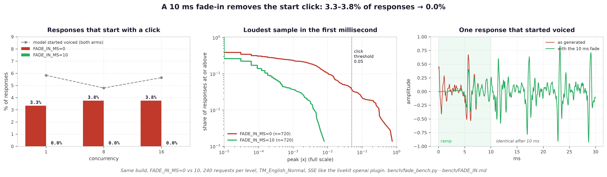

# Fade-in: the click at the start of a response

**Measured 2026-09-23.** `FADE_IN_MS` (default 10, `app/fade.py`).



## The problem

About 1 request in 20, the LM's first speech tokens are already voiced. The first decoded
window then starts mid-waveform, and the API emitted it as is:


A normal response opens with tens of milliseconds of near-silence. One of these opens at
full speech level on its very first sample.

## The fix

A raised-cosine ramp over the first `FADE_IN_MS` of every response, applied last —
after crossfade, loudness normalization and time stretch — so it shapes exactly what the
caller hears first.

- On a normal response the ramp lies over near-silence. Nothing audible changes.
- Samples after the ramp are untouched (bit-exact).
- Output is identical however the byte stream is chunked, odd byte boundaries included
  (`tests/test_fade.py`, 8 tests).

## Benchmark

Same build twice on one GPU, `FADE_IN_MS=0` vs `10`. 30 agent-style lines
(`bench/fade_texts.txt`), `TM_English_Normal`, sent like livekit's `openai.TTS` plugin
(SSE, speed 1.0, server defaults), 240 requests per level.

Two measures per response:

| measure | definition | what it tells |
|---|---|---|
| **click** | loudest sample in the first 1 ms > 0.05 full scale | the audible edge — what the fade removes |
| **hot** | first 10 ms within 25 dB of the response's speech level | the model started voiced — the cause |

| concurrency | click, fade off | **click, fade on** | hot, fade off | hot, fade on |
|---|---|---|---|---|
| 1 | 3.3% | **0.0%** | 5.4% | 6.2% |
| 8 | 3.8% | **0.0%** | 6.2% | 3.3% |
| 16 | 3.8% | **0.0%** | 4.6% | 6.7% |

| | fade off | fade on |
|---|---|---|
| loudest first millisecond, p99 | 0.24–0.32 | **0.003–0.004** |
| loudest first millisecond, max | 0.747 | **0.008** |

- **Clicks go to zero at every load.**
- **The hot rate does not move** (3–7% in both arms), and it shouldn't: a 10 ms ramp reaches
  full level by the end of the 10 ms that measure looks at. The fade treats the symptom.
- **Not load.** Clicks sit at 3.3–3.8% from concurrency 1 to 16. It is the model's output.

## Which lines start voiced

Hot-start rate per line, both arms pooled (48 requests each):

| line | hot start |
|---|---|
| "We can certainly help you with that." | 20.8% |
| "One moment while I pull up your details." | 16.7% |
| "Our technician will contact you within two working days." | 14.6% |
| "Unfortunately, we are unable to process that request right now." | 12.5% |
| "I can help you with that today." | 10.4% |
| 8 of the 30 lines | 0% |

Lines that open on a vowel or a glide ("We", "One", "Our", "I") start voiced most. The model
runs straight into the first sound instead of leading in with silence.

## What it does not fix

The fade removes the click, not the cause. When the LM starts mid-sound, the first word
itself can come out malformed, and no amount of gain shaping repairs that. Candidates to
attack the cause, untested:

- prime the prompt with a few speech tokens of silence after `<|speech_start|>`, so the LM
  continues from silence;
- detect a voiced first window and regenerate it.

## Side note

One of the 1,440 responses ("Please hold for a moment.") came back under 0.2 s long — the
LM stopped almost immediately. Unrelated to the fade; reported by the script as `unscored`.

## Reproducing

```bash
# two instances of one build, differing only in FADE_IN_MS
FADE_IN_MS=0  uvicorn app.main:app --port 9098 &
FADE_IN_MS=10 uvicorn app.main:app --port 9097 &

python bench/fade_bench.py --url http://127.0.0.1:9098 --texts bench/fade_texts.txt \
  --concurrency 1,8,16 --per-level 240 --label nofade --out /tmp/fade
python bench/fade_bench.py --url http://127.0.0.1:9097 --texts bench/fade_texts.txt \
  --concurrency 1,8,16 --per-level 240 --label fade --out /tmp/fade

PYTHONPATH=. pytest tests/test_fade.py -q
```

Raw data: `bench/results/fade-2026-09-23/`.
