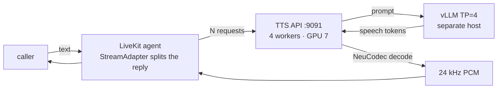
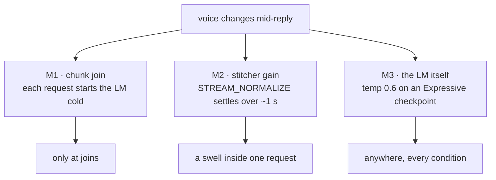
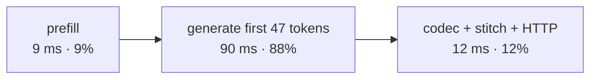
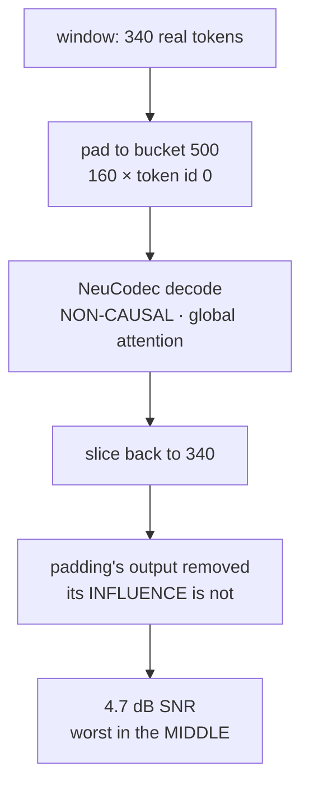
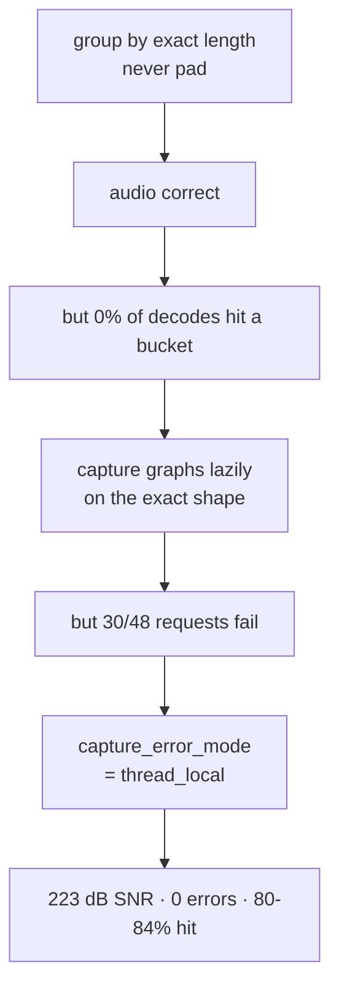
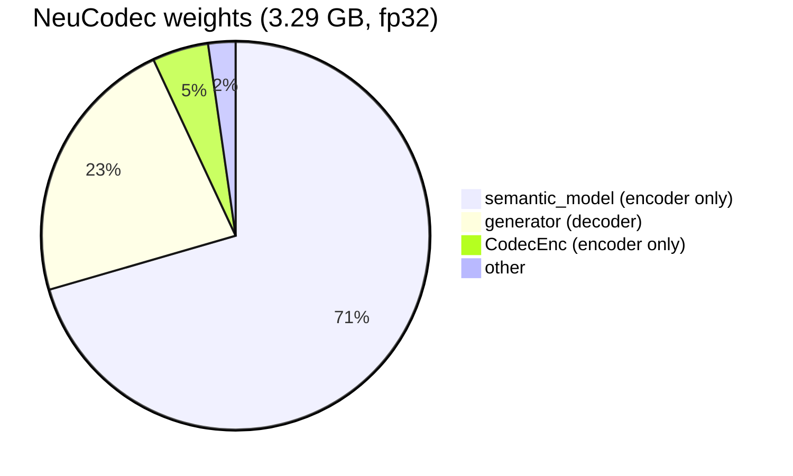
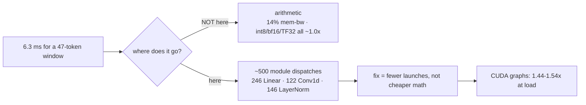

# Voice quality and latency: what a demo complaint turned into

**2026-09-18 → 2026-09-22.** One report from a demo session — *"the voice goes from calm and even
to loud and excited part-way through"* — with no recording. This is the chain of measurements that
came out of it, what was found, and what was wrong.

---

## The stack under test

One reply becomes several independent TTS requests. That split is the origin of most of what
follows.

---

## 1. Three mechanisms sound identical

"Loud and excited part-way through" has three possible causes. Only an experiment separates them.

**Measured** (`bench/PITCH_TONE_AB.md`, 840 utterances, 0 errors). An "event" = two adjacent 0.5 s
voiced windows where level rises ≥3 dB **and** register ≥1.5 st together.

| condition | events / 1k windows | utterances hit |
|---|---|---|
| one request, normalizer **off** | 30.8 | 25/120 |
| one request, normalizer on | 27.0 | 19/120 |
| **through LiveKit** | **55.4** | **42/120** |
| through LiveKit + `interleave_id` | 51.4 | 35/120 |

**Verdict.**

- **M2 is not the cause.** Gain off is *worse*, not better. Hypothesis dropped.
- **M1 is real**: +2.4 dB and +1.7 st **upward** at two-thirds of joins.
- **M3 is the floor**: 25/120 utterances jump with no chunking and no normalizer at all.

Roughly half of what a caller hears is chunking. The other half is the model.

---

## 2. Volume wander is the speaker's own recordings

Chunk-to-chunk level spread inside one reply:

| arm | level sd | replies with a >3 dB step |
|---|---|---|
| normalizer **off** | 1.87 dB | 67% |
| **today** | 1.19 dB | 29% |
| gain carried across chunks | 1.45 dB | 52% |

Carrying the gain **made it worse**. A shared gain preserves each chunk's deviation instead of
correcting it. `bench/INTERLEAVE_AB.md`'s proposal to do this is now marked tried-and-wrong.

The residual traces to the dataset (`scicom/dataset/tm-voice/LOUDNESS.md`):

| speaker | recordings with a >3 dB chunk step |
|---|---|
| TM_Malay | 2% |
| TM_Mandarin | 4% |
| TM_English | 4% |
| **TM_English_Normal** (served) | **23%** |

The model reproduces its speaker: **29%** of generated replies. Serving-side normalisation already
closes most of the gap between the model's raw output (67%) and its training data (23%). It cannot
go below the data.

**Fix**: loudness-normalise before NeuCodec encoding. Shipped in GPUPlatform as
`neucodec_normalize` with a dropdown on the dataset Transform tab. Verified by ear on real
recordings; the normalised versions sound better, transient cases included.

---

## 3. Latency: the LM owns TTFB, the codec owns throughput

| path | TTFB p50 |
|---|---|
| API direct, on-box | **102 ms** |
| + LiveKit agent + WebRTC | **225–237 ms** |
| a prod agent trace | **324 ms** |

LiveKit adds ~130 ms and fattens p95/p50 from ~1.15× to 2.2–2.5×. The median is healthy; the tail
is the agent, not synthesis.

**Throughput saturates on the codec GPU**, not the LM:

| conc | codec GPU | codec mem-bw | audio-s/s | client lead |
|---|---|---|---|---|
| 16 | 37% | 2% | 127 | 1.93 s |
| 32 | 74% | 4% | 208 | 1.68 s |
| 64 | 82% | 5% | 284 | 1.20 s |
| 96 | **96%** | 6% | 304 | **0.19 s** |

96% busy at 6% bandwidth = launch-bound, not bandwidth-bound.

---

## 4. The TP sweep refuted its own premise

`bench/TTFB.md` carried a warning that 557 tok/s on TP=4 was "suspicious" and that a single card
should reach ~1000 tok/s. **Wrong.**

| TP | tok/s | TTFB p50 |
|---|---|---|
| 1 | 469 | 0.119 s |
| 2 | 498 | 0.113 s |
| **4** | **557** | **0.102 s** |

TP=4 is the best of the three. The "~5% over TP=2" figure compared two *different nodes*. On one
node TP=4 buys 11.8%.

The bandwidth model was wrong too. All four ranks run at **98% occupancy and 14% memory bandwidth**,
the co-tenant STT engine idle, rank 3 no slower than rank 0. Neither contention nor collective
stalls — many tiny kernels per token.

---

## 5. The decode batcher was corrupting audio

Reported as *"enabling CUDA_GRAPH_BATCH degrades quality"*. It does.

| case | SNR vs decoding alone |
|---|---|
| padded to graph bucket 500 | **4.7 dB** |
| batched with a longer request, **no buckets** | **−1.3 dB** |
| batched with a **same-length** request | **72.3 dB** — identical |

Not a CUDA-graph bug. A **padding** bug. It also fires with graphs off whenever dynamic batching
pairs different lengths.

CLAUDE.md claimed this was impossible: *"bit-identical decode operations … accuracy cannot regress
by construction"*. The graph *replay* is bit-identical. The **input** was not.

**Why nothing caught it**: the CER guardrail runs at concurrency 1, where nothing is padded.

### The fix, and what each step exposed

Fixed buckets are useless once you stop padding — **0 of 150** real decodes landed on one. The
stitcher produces 47 / 121 / 269, not multiples of 50. Those three are 64% of all decodes, so a
cache on the exact shape hits 80–84%.

### What it costs

| conc | eager | + lazy graphs | speedup | pre-fix (wrong audio) | cost of correctness |
|---|---|---|---|---|---|
| 8 | 66.7 | 65.8 | 1.0× | 67.6 | −3% |
| 32 | 132.2 | 190.6 | **1.44×** | 209.4 | −9% |
| 64 | 138.8 | 213.4 | **1.54×** | 296.2 | **−28%** |

Graphs only pay once the codec GPU is the constraint. Correctness costs up to 28% at high load.
Worth paying: the alternative is 2.1× throughput at 10.6 dB SNR.

---

## 6. Precision and quantization: nothing helps, and the reason matters

The codec runs **fp32** today — 823M params, 3.29 GB.

Every arm below was measured against the untouched fp32 output, at the three windows that
carry ~64% of real traffic. Speedup is `x`; SNR is against fp32, so 224 dB means exact.

| arm | w47 ×/SNR | w121 ×/SNR | w269 ×/SNR | verdict |
|---|---|---|---|---|
| fp32 eager (baseline) | 1.00 / — | 1.00 / — | 1.00 / — | — |
| **fp16** | — | — | — | **impossible** |
| bf16 | 0.92 / 33 dB | 0.99 / 38 dB | 1.31 / 37 dB | no |
| TF32 | 1.00 / 63 dB | 0.97 / 65 dB | 1.25 / 65 dB | no |
| fold `weight_norm` (37) | 0.97 / **224 dB** | 0.99 / **224 dB** | 1.00 / **224 dB** | exact, but free of gain |
| `cudnn.benchmark` | 0.99 / **224 dB** | 0.99 / **224 dB** | 1.00 / **224 dB** | exact, but free of gain |
| TF32 + fold + cudnn | 0.99 / 63 dB | 0.96 / 65 dB | 1.24 / 65 dB | no |
| **int8 weight-only** | 0.76 / 32 dB | 0.76 / 36 dB | 1.09 / 36 dB | **no — slower** |
| **int8 dyn act + weight** | **0.06** / 26 dB | **0.05** / 29 dB | **0.07** / 29 dB | **no — 16-20× slower** |

**fp16 cannot run at all**: `cuFFT only supports dimensions whose sizes are powers of two`. The
vocos ISTFT is fp32-or-nothing. Not a tuning problem.

**int8 is decisively worse on both axes.** Weight-only is 24% *slower* at the dominant windows and
costs 32–36 dB. Dynamic activations make it 16–20× slower. The quantize/dequantize overhead
dwarfs the arithmetic at these shapes, and Conv1d has no fast int8 path here. int8 is not a
near-miss worth tuning; it is the wrong direction.

**bf16 and TF32 only help the largest window** (1.25–1.31× at w269) and do nothing — or hurt — at
w47/w121, which are half of all decodes.

**The two exact optimisations buy nothing.** Folding `weight_norm` removes 37 per-forward norm
recomputations and is bit-identical; `cudnn.benchmark` autotunes the 1-D convs and is bit-identical.
Both measure 0.97–1.00×.

### Why every arithmetic optimisation fails

Decode at these window sizes is **launch-bound, not compute-bound**. Making each kernel's maths
cheaper cannot help when the time goes to *reaching* the kernels. That is exactly why CUDA graphs
delivered 1.44–1.54× under load while every precision and quantization arm delivered ~1.00×.

**So: there is no meaningful win left at the arithmetic level.** The remaining lever is reducing
the *number of dispatches* — graphs (done) or a fused kernel (§"Open", item 5).

**One free win that is not about speed**: 2.5 GB of the 3.29 GB is `semantic_model` + `CodecEnc`,
used only by `/v1/audio/vc`. A TTS-only worker could skip loading them — about 10 GB back across
4 workers.

## What was wrong, and why

Three claims in this repo were stated with confidence and were false. All three came from
reasoning instead of measuring.

| claim | reality |
|---|---|
| "CUDA graphs are bit-identical, accuracy cannot regress" | 4.7 dB SNR. The input changed, not the op. |
| "557 tok/s on TP=4 is suspicious, one card should do ~1000" | TP=4 is fastest. Bandwidth was never the limit. |
| "carrying the locked gain will fix level steps" | Made it worse: 29% → 52%. |

Two measurement traps cost real time:

- **A hash is the wrong test.** Batch size alone shifts output ~1e-4 (cuBLAS reduction order) —
  flips a SHA, sits 90 dB down.
- **Firing N requests at once does not produce mixed-length batches.** They run in lockstep. The
  bug hides. Staggered arrivals are what trigger it.

And one metric proved unfit:

- **UTMOSv2 scored the corrupted build *higher* than the reference** (+0.054 MOS), and the
  bit-identical build lower (−0.030), both inside its own ±0.12–0.17 noise. It is blind to
  broadband additive corruption. Do not use it to validate this class of change.

---

## Open, in priority order

1. **Make window lengths collide** instead of padding them apart — quantise the stitcher schedule
   so concurrent requests share lengths. Recovers the 28%, never pads. The shapes are already
   concentrated, so this looks achievable.
2. **Land the padding fix on the deployment.** `tts-api-1023` still runs the unpatched code.
3. **Dataset loudness normalisation** — `neucodec_normalize=fixed_target` on the next pack.
4. **Skip the encoder on TTS-only workers** — ~10 GB.
5. **The LM megakernel.** 98% occupancy at 14% bandwidth is the regime it targets. TP=1 would be
   the build. Bigger project; measure (1)–(4) first.
