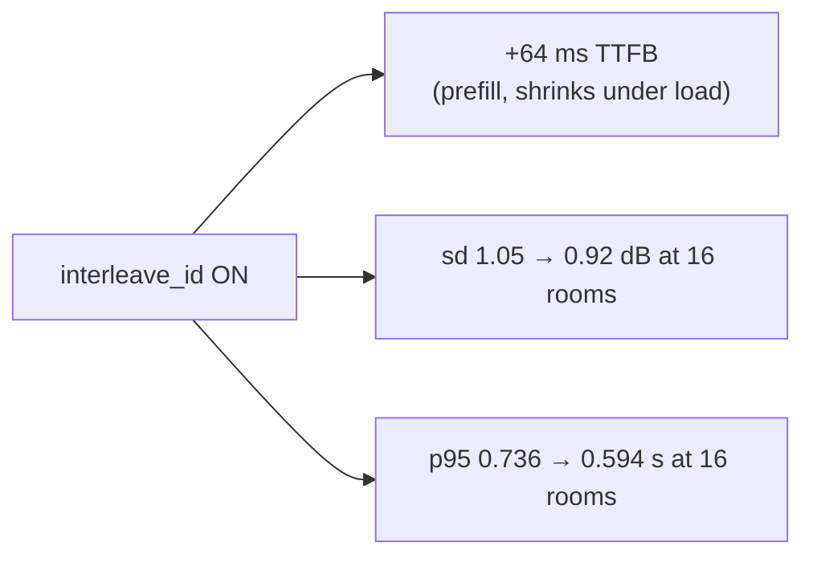

# TTS through a real LiveKit agent

**Measured 2026-09-23.** Text in → WebRTC audio out, through `livekit-server` + a real
`livekit-agents` worker + the `openai.TTS` plugin. No STT, no LLM, no VAD — so what is
measured is the TTS path and the transport around it, nothing else.


```
load_client.py ──text on "tts-input"──▶ livekit-server ──job──▶ stress_agent.py
     ▲                                                              │
     │                                                    session.say()
     │                                                              ▼
     └────────── WebRTC audio track ◀── agent publishes ◀── openai.TTS plugin
                                                                    │
                                                        /v1/audio/speech (pcm)
                                                                    ▼
                                                        this repo's app :9095
```

## Headline

| | result |
|---|---|
| TTFB through LiveKit | **0.23 – 0.26 s**, flat from 1 to 16 rooms |
| Cost of the agent + WebRTC | **+111 to +136 ms** over raw HTTP, flat |
| Errors, 1–16 rooms, both arms | **0 / 688 utterances** |
| Loudness sd per utterance | **0.92 – 1.26 dB** at every level |
| `interleave_id` cost | **+49 to +78 ms** TTFB |
| Ceiling | the **rig** at 32 rooms — the API is clean to 64 |

## The numbers

Eight utterances per room, `TM_English_Normal`, patched app (one H20) against a TP=4 LM
on another host.

| rooms | LiveKit p50 | p95 | +interleave p50 | p95 | HTTP direct p50 | agent tax | errors |
|---|---|---|---|---|---|---|---|
| 1 | 0.232 | 0.589 | 0.310 | 0.599 | 0.102 | +130 ms | 0 |
| 4 | 0.246 | 0.613 | 0.316 | 0.637 | 0.111 | +135 ms | 0 |
| 8 | 0.256 | 0.698 | 0.316 | 1.192 | 0.120 | +136 ms | 0 |
| 16 | 0.258 | 0.736 | 0.307 | 0.594 | 0.147 | +111 ms | 0 |

Loudness, same runs:

| rooms | LiveKit sd | p95−p5 | +interleave sd |
|---|---|---|---|
| 1 | 1.06 | 3.76 | 1.08 |
| 4 | 1.26 | 4.94 | 1.04 |
| 8 | 0.94 | 2.87 | 0.94 |
| 16 | 1.05 | 3.59 | **0.92** |

## Four findings

### 1. The agent + WebRTC tax is a constant, not a slope

130 ms at one room, 111 ms at sixteen. It does not grow with load. Opus encode, the
plugin's buffering and the track hop cost what they cost, once.

The consequence: **a LiveKit TTFB regression is almost never LiveKit.** Subtract ~130 ms
and look at the API.

### 2. TTFB is flat to 16 rooms; the API is flat to 64

LiveKit p50 moves 0.232 → 0.258 across a 16× load increase. Straight at the API:

| concurrency | 1 | 4 | 8 | 16 | 32 | 64 |
|---|---|---|---|---|---|---|
| TTFB p50 | 0.102 | 0.111 | 0.120 | 0.147 | 0.486 | 0.920 |
| RTF p50 | 0.094 | 0.100 | 0.106 | 0.114 | 0.174 | 0.340 |
| audio-s/s | 10.6 | 39.1 | 70.3 | 129.6 | 171.2 | **179.4** |
| errors | 0 | 0 | 0 | 0 | 0 | 0 |

Throughput saturates between 32 and 64 (171 → 179 audio-s/s). Even at 64 the stack is
3× faster than real time and nothing stalls.

### 3. `interleave_id` costs ~64 ms of TTFB and buys loudness consistency

The cost is the extra prefill, exactly as `INTERLEAVE.md` predicts — and it *shrinks* as
load rises (78 ms at one room, 49 ms at sixteen), because prefill overlaps with other
work once the LM is busy.

What it buys, at 16 rooms: loudness sd **1.05 → 0.92 dB**, and the TTFB tail actually
*improves* (p95 0.736 → 0.594). At 1–8 rooms the loudness difference is inside noise.



⚠ Only on an interleave-trained checkpoint. On anything else the same prompt shape is a
regression risk (`bench/INTERLEAVE_AB.md` §7).

### 4. `STREAM_NORMALIZE` holds through the whole transport

Per-utterance sd stays in **0.92 – 1.26 dB** at every concurrency, both arms. The 2026-08
run recorded 2.3 – 10.1 dB with the normalizer off. Opus and the WebRTC hop do not undo it.

⚠ Do not read max−min as the spread. It is an extreme-value statistic and grows with
sample count alone — n=8 at one room vs n=128 at sixteen. The figure plots **p95−p5**,
which is stable, and that stays 2.87 – 4.94 dB with no trend.

## Two traps that produced wrong answers

Both were recorded as server results before being caught. Both were the rig.

### The load client was the bottleneck at 16 rooms

The first 16-room run reported **TTFB p50 8.4 s**, then 14.1 s on a repeat — a clean
cliff after 0.25 s at 8 rooms. It looked like saturation.


It was not. Same 16 rooms, split across two client processes of 8, nothing server-side
touched: **0.307 s**. 45× better.

One python process cannot drive many rooms. Each room's coroutine scans its frame buffer
and runs numpy RMS on the shared event loop, so the client's own scheduling delay gets
charged to the server as TTFB. During the bad run the TTS app averaged **19% of one core**.

Fixed in `load_client.py`: `--procs` (default one process per 8 rooms) shards rooms
across processes and merges the rows.

### File descriptors, not latency

Before that, 16 rooms failed with `Too many open files (os error 24)` on the default
1024-fd limit — each room opens several WebRTC sockets. The surviving rooms reported
7.5 s TTFB, which also read as server saturation. `load_client.py` now raises `RLIMIT_NOFILE`
itself when it shards.

**The rule both traps share: before believing a latency cliff, check what the service
under test was doing.** If it is idle, the cliff is yours.

## The 32-room ceiling

32 rooms does not run clean on this rig. Best result was 40/67 utterances; most runs
failed most rooms with `agent audio track never arrived`, and the agent log shows
`The room connection was not established within 10 seconds after calling job_entry`.

Three things were tried:

| change | result |
|---|---|
| `num_idle_processes=40` (was default) | 0 → 40 utterances OK |
| `await ctx.connect()` before `session.start()` | correct order, no effect at 32 |
| UDP port range 51000–52000 instead of one muxed port | 24/53 OK |

Each helped; none fixed it. The remaining limit is ICE setup for 64 simultaneous peer
connections through one dev-config `livekit-server` on a shared, busy box.

**This is not the TTS API.** At 32 concurrent requests the API returns TTFB p50 0.486 s
with 0 errors, and at 64 it returns 0.920 s with 0 errors. Every room that *did* connect
at 32 got its audio at a normal **0.243 s**.

The connect ordering fix is kept anyway — `session.start()` before `ctx.connect()` is
wrong, it just was not what was failing here.

## Reproducing

```bash
# server + agent
livekit-server --config livekit.yaml &
TTS_INTERLEAVE=false AGENT_IDLE_PROCESSES=8 python bench/livekit/stress_agent.py start &

# sweep — --procs defaults to one client process per 8 rooms
for c in 1 4 8 16; do
  python bench/livekit/load_client.py --url ws://127.0.0.1:7885 \
    --concurrency $c --utterances 8 --texts bench/pitch_stress_texts.txt \
    --out results/lk_cold_c$c.json
done

# the same levels straight at the API, for the tax
python bench/latency_bench.py --url http://127.0.0.1:9095 \
  --concurrency 1,4,8,16,32,64 --texts bench/pitch_stress_texts.txt \
  --per-conc-mult 8 --min-requests 8 --out results/direct.json
```

Raw data: `bench/results/livekit-2026-09-23/`. Figures: `bench/plots/make_figures.py`.

## Related

- `bench/livekit/README.md` — the rig itself, setup and gotchas
- `bench/PITCH_TONE_AB.md` — pitch/tone/volume steps, direct vs LiveKit
- `bench/INTERLEAVE_AB.md` — what `interleave_id` does to chunk joins
- `bench/TTFB.md` — where the API's own 100 ms goes
