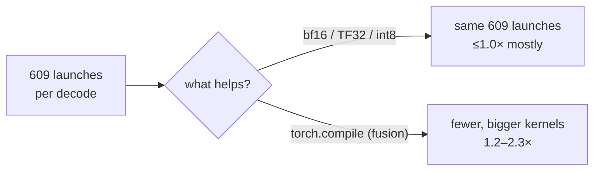

# Megakernel decode: `torch.compile` on NeuCodec

**Measured 2026-09-22/23**, one H20, batch 1, real LM token streams, fp32.

## Why try fusion at all

Every precision and quantization arm failed (`PADDING_BUG.md`, `precision_matrix.png`):
bf16, TF32, int8 — none beat fp32 eager. The reason:

| | |
|---|---|
| kernel launches per w121 decode | **609** |
| distinct ops | **51** |
| codec GPU util at c=96 | 96% |
| memory-bandwidth util | **6%** |

The decoder is **launch-bound**. Cheaper arithmetic cannot help when the time goes to
reaching ~600 tiny kernels. Fusing them can.

## Result

Per decode, ms (speedup vs fp32 eager):

| arm | w47 | w121 | w269 | SNR vs eager |
|---|---|---|---|---|
| eager fp32 | 6.24 | 6.29 | 9.39 | — |
| compile `default` | 3.24 (1.93×) | 4.22 (1.49×) | 8.07 (1.16×) | 80–82 dB |
| compile `reduce-overhead` | **2.75 (2.27×)** | 3.98 (1.58×) | 7.88 (1.19×) | 80–82 dB |
| compile `max-autotune` | 2.77 (2.25×) | **3.95 (1.59×)** | **7.85 (1.20×)** | 74–80 dB |

- **Biggest win on small windows.** w47 is almost pure launch overhead, so fusion halves it.
  w269 has real compute and gains only ~1.2×.
- **`reduce-overhead` is the pick.** Same speed as `max-autotune`, higher SNR, no autotune search.
- **Not bit-exact.** ~80 dB SNR — inaudible, but a changed decode. The graphs path stays
  bit-exact (223 dB). A sample-wise diff, not UTMOSv2, is the right gate (`PADDING_BUG.md`).

## The catch: ~10 s per new shape

| shape | 47 | 121 | 269 | 187 | 95 |
|---|---|---|---|---|---|
| compile, `dynamic=False` | 11.2 s | 9.5 s | 10.4 s | 11.5 s | 11.7 s |
| compile, `dynamic=True` | 12.7 s | 9.2 s | 10.0 s | 9.4 s | 9.5 s |

- `dynamic=True` **does not amortise** — it still compiles per length, and its steady state is
  slower (w47 4.62 ms vs 2.75 ms).
- The stitcher produces many distinct lengths. The lazy graph cache sees **80–84% hits**,
  so the tail is a stream of new shapes. Each one would stall a live request ~10 s.

## Verdict

| option | speed | risk |
|---|---|---|
| lazy CUDA graphs (shipped) | 1.44× at c=32, 1.54× at c=64 | bit-exact |
| compile `reduce-overhead` | up to 2.27× per decode | ~10 s stall per new shape, ~80 dB |

**Not enabled.** It only becomes safe with a **fixed shape set**: pre-compile at startup and
quantise the stitcher's window schedule so every decode lands on one of them — without
padding, which corrupts (`PADDING_BUG.md`). That same change also recovers the 28% the
padding fix cost at c=64. One piece of work, two wins; it is the next step if codec
throughput ever matters.

## Reproducing

`TORCH_COMPILE=true` selects the compile path in `app/main.py`. Tensor-level timing: decode
one real token stream eager vs `torch.compile(decoder, mode=...)` after warm-up, compare
`max|Δ|` / SNR on the samples, and count launches with `torch.profiler`.
