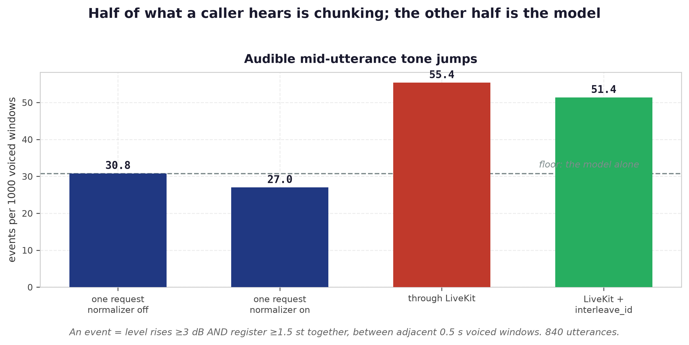

# Pitch, tone and volume: direct API vs through LiveKit

**Measured 2026-09-18** on a shared H20-3e dev box, GPU 6 (vLLM) + GPU 7 (codec), against
`Scicom-intl/Multilingual-Expressive-TTS-1.7B-interleave-pitchfilter-best` — the checkpoint prod
serves — with prod's own app settings (`jobs/<cluster>/tts-api.yaml`: `TM_English_Normal`,
temperature 0.6, repetition penalty 1.15, `DEFAULT_PLAYBACK_SPEED=0.75`, eager decode,
4 uvicorn workers, `STREAM_NORMALIZE` on).

## Why this exists

A demo session reported the voice going **"from calm, even tone to loud and excited part-way
through"**. There is no recording — the finding is second-hand from the room — so this reproduces
the complaint from its description rather than from the artefact, and the description's load-bearing
word is *mid-utterance*. Three different mechanisms produce that sound and only an experiment
separates them:

| | mechanism | where it would show |
|---|---|---|
| **M1** | a step at a **chunk join** — LiveKit's `StreamAdapter` cuts a reply into several `/v1/audio/speech` calls and each starts the LM cold, so it picks a fresh register and energy | only at joins |
| **M2** | the **stitcher's loudness gain** — `STREAM_NORMALIZE` estimates the gain from what it has emitted and slews it until it locks at ~1 s of voiced audio (`app/main.py normalize_chunk`) | a swell inside one request |
| **M3** | the **LM itself** — sampling at temp 0.6 from an *Expressive* checkpoint can change register part-way through | anywhere, in every condition |

## What was run

Two conditions, same 30 sentences (`bench/pitch_stress_texts.txt`, TM voicebot replies, Malay +
English), same speaker, same server, 120 utterances per arm — **840 utterances, 0 errors**.

**Direct API** (`bench/pitch_stress.py`), five arms at concurrency 1 and 8:

| arm | what it isolates |
|---|---|
| `oneshot_raw` | one request, `stream_normalize=false` → **M3 alone** |
| `oneshot_norm` | one request, normalizer on → M3 + M2 |
| `chunked_raw` / `chunked_norm` | ~5-word chunks, one request each, concatenated → + M1 |
| `chunked_interleave` | same, with `interleave_id` → how much of M1 interleaving takes back |

**Through LiveKit** (`bench/livekit/`), a real agent + WebRTC path, no STT and no LLM — text on the
`tts-input` topic goes straight to `session.say()` → `openai.TTS` plugin → the same API, and the
audio is captured off the agent's published track. Two arms, 4 concurrent rooms:
`lk_cold` (today's behaviour) and `lk_interleave` (**new** — the agent now sends `X-Interleave-Id`,
see below).

Scoring (`bench/pitch_stress_score.py`) is frame-level f0 + level at 10 ms, and the headline is not
a mean — a mean is exactly what hides a one-off jump.


 It is a **rate of audible events**: two
adjacent 0.5 s windows of voiced speech where the level rises ≥3 dB **and** the register rises
≥1.5 st *at the same time*. Either alone moves constantly in normal speech; the conjunction is what
a listener calls a change of tone.

## Results

### Tone — mid-utterance jumps (the actual complaint)

| arm | window pairs | events | **per 1k** | utterances hit | worst |
|---|---|---|---|---|---|
| `oneshot_raw` (model alone) | 813 | 25 | **30.8** | 25/120 | +12.9 dB, +6.6 st |
| `oneshot_norm` | 815 | 22 | **27.0** | 19/120 | +17.8 dB, +9.1 st |
| `chunked_raw` | 121 | 3 | 24.8 | 3/120 | +5.2 dB, +4.5 st |
| `chunked_norm` | 131 | 6 | 45.8 | 5/120 | +10.1 dB, +5.6 st |
| `chunked_interleave` | 143 | 2 | 14.0 | 2/120 | +11.8 dB, +3.7 st |
| **`lk_cold`** | 920 | 51 | **55.4** | **42/120** | +12.1 dB, +9.6 st |
| **`lk_interleave`** | 778 | 40 | **51.4** | 35/120 | +14.1 dB, +10.3 st |

**The complaint is real and it is not imaginary or rare: 42 of 120 utterances through LiveKit
carry at least one simultaneous ≥3 dB / ≥1.5 st jump mid-utterance**, and the worst are +12 dB with
+10 semitones — a whole octave, which is unmistakably "suddenly excited".

⚠ One caveat on the direct comparison: the API arms have their chunk joins *excluded* (±0.6 s
keep-out at known offsets), while the LiveKit arms cannot — the agent chops the text itself and the
boundaries are invisible from the audio track. So `lk_cold`'s 55.4 includes its joins and
`oneshot_*`'s ~27–31 has none to include. Read it as: **a caller hears roughly twice the rate of
tone jumps that the same text rendered in one request would give**, and the excess is at the joins
LiveKit creates.

### Pitch and volume at chunk joins (API arms, exact offsets)

Signed, so + means *louder and higher after the join*:

| arm | joins | Δ level | Δ register | register reset | **both thresholds** |
|---|---|---|---|---|---|
| `chunked_raw` | 460 | **+2.44 dB** | **+1.55 st** | 66% | 26% |
| `chunked_norm` | 460 | **+2.36 dB** | **+1.80 st** | 63% | 26% |
| `chunked_interleave` | 460 | +4.15 dB | +1.94 st | 68% | 35% |

Every chunked arm steps **up** at the join, in both loudness and pitch, about two-thirds of the
time — the register-reset signature from `bench/INTERLEAVE_AB.md`, and a quarter of all joins clear
both audibility thresholds at once. This is M1, and it is the single largest effect measured.

### Volume — per-utterance level

| arm | mean | sd | spread | opening − rest |
|---|---|---|---|---|
| `oneshot_raw` | −15.24 dB | 1.35 | 8.01 | +2.19 dB |
| `oneshot_norm` | −16.04 dB | 1.27 | 6.91 | +1.90 dB |
| `chunked_norm` | −15.28 dB | 0.46 | 3.45 | +1.22 dB |
| `lk_cold` | −15.79 dB | 0.96 | 5.11 | +1.83 dB |
| `lk_interleave` | −15.49 dB | 0.86 | 5.40 | +1.71 dB |

Through the load client's own per-utterance measure: `lk_cold` RMS sd **0.90 dB**, `lk_interleave`
**0.78 dB**, peak 1.0 in both (the soft-knee limiter's ceiling, not clipping). Volume call-to-call
is controlled. LiveKit adds nothing here.

## What this says about the three mechanisms

**M2 — the loudness normalizer — is not the cause, and the hypothesis that it is should be dropped.**
`oneshot_raw` (gain off) has *more* mid-utterance events than `oneshot_norm` (30.8 vs 27.0) and a
*larger* opening-vs-rest level difference (+2.19 vs +1.90 dB). If the gain's pre-lock slew were
producing swells, turning it off would remove them; it does not. The opening being louder than the
body is present with the gain off, so it is ordinary declination, not the AGC.

**M3 — the LM — is the floor, and it is not small.** One request, gain off, no joins at all, still
produces 30.8 events per 1k and 25 of 120 utterances with an audible jump. Nothing downstream can
fix that; it is a property of sampling an Expressive checkpoint at temperature 0.6.

**M1 — chunk joins — is the largest single effect and the one LiveKit introduces.** +2.4 dB and
+1.6–1.8 st, upward, at two-thirds of joins.

**Where LiveKit actually cuts matters, and it is better than feared.** The interleave store shows
what the agent sent: `"Your account is registered to IC number nine…"` then `"Could you confirm that
is correct?."` — `StreamAdapter` split at **sentence** boundaries, not mid-sentence. So on
well-punctuated text the joins land where a pause belongs. A genuinely *mid-sentence* jump therefore
cannot be a join on this corpus, and must be M3. An LLM streaming long unpunctuated sentences could
still be split mid-clause, which is the case the 5-word `chunked_*` arms bracket.

## `interleave_id` through LiveKit — now wired up

`bench/livekit/stress_agent.py` gained `TTS_INTERLEAVE` (default on). The plugin drives the stock
`openai` client and cannot add body fields, so the id rides the `X-Interleave-Id` header, one id per
room, exactly as `INTERLEAVE.md` §6 prescribes:

```python
client = openai_sdk.AsyncClient(api_key="unused", base_url=TTS_BASE_URL,
                                default_headers={"X-Interleave-Id": ctx.room.name}, max_retries=0)
session = AgentSession(tts=openai.TTS(client=client, model=..., voice=..., response_format="pcm"))
```

Verified end to end: the store held 4 retained turns per room with the real chunk texts, and the
deployed endpoint accepts it too (`x-interleave-turns: 1` on a plain curl).

What it bought, and what it cost:

| | `lk_cold` | `lk_interleave` |
|---|---|---|
| mid-utterance events / 1k | 55.4 | **51.4** (−7%) |
| utterances with ≥1 event | 42/120 | **35/120** (−17%) |
| register step at pauses, signed | −4.07 st | −1.76 st |
| per-utterance RMS sd | 0.90 dB | **0.78 dB** |
| **TTFB p50** | **0.462 s** | **0.603 s** (+141 ms) |
| TTFB p95 | 0.651 s | 0.821 s |

A real but modest improvement, at **+141 ms of TTFB** — more than `INTERLEAVE.md`'s "tens of ms",
because prod runs `DEFAULT_PLAYBACK_SPEED=0.75` and the history prefill is now a visible share of a
much shorter first window. That trade is a product call, not a technical one.

On the 5-word API arms interleaving made joins **worse** (+2.36 → +4.15 dB, 26% → 35% over both
thresholds) while on LiveKit's sentence chunks it helped. The coherent reading is that interleaving
continues a phrase, which is right when the chunk is a sentence and wrong when the chunk is an
arbitrary 5-word cut that leaves the model mid-phrase — but that is a hypothesis from two arms, not
a measured mechanism.

## What to do

1. **Do not spend effort on `STREAM_NORMALIZE`.** It is measurably not the cause, and switching it
   off makes mid-utterance variation slightly worse while giving back the clipping it prevents.
2. **The biggest available win is not to chunk at all where it is avoidable.** Every join costs
   ~+2.4 dB and ~+1.7 st upward. If the agent can hand the TTS a whole sentence-group instead of a
   sentence, it should.
3. **Ship `X-Interleave-Id` from the agent** if 140 ms of TTFB is acceptable — it is a small,
   genuine improvement and it is already written. Gate it on serving an interleave-trained
   checkpoint (prod does).
4. **The floor is the model.** A third of the remaining events survive every mitigation, in a single
   uninterrupted request with no normalizer. Lowering `DEFAULT_TEMPERATURE` is the lever with a
   measured precedent — the 2026-09-02 sweep found 0.3 beat 0.6 on all four of probe accuracy, CER,
   WER and MOS at once — and would be the next experiment, scored with this same rig.
5. **Record the demo sessions.** Every number here rests on a second-hand sentence. A 10-second clip
   would have told us in a minute which of M1/M2/M3 it was.

## Reproducing

```bash
# direct API
python bench/pitch_stress.py --url http://127.0.0.1:9191 --texts bench/pitch_stress_texts.txt \
  --voice TM_English_Normal --concurrency 1,8 --reps 2 --out results/pitch_stress
# through LiveKit (livekit-server + bench/livekit/stress_agent.py running)
TTS_INTERLEAVE=true python bench/livekit/load_client.py --concurrency 4 --utterances 30 \
  --texts bench/pitch_stress_texts.txt --wav-dir results/lk --arm lk_interleave
# score either the same way
python bench/pitch_stress_score.py --dir results/lk
```

Worst-case clips and both `scores.json` are in
`ucc_ai_research/evaluation/tts/synthetic-audio/2026-09-18-pitch-tone/`.

Two traps if you touch the scorer: a window that is half pause reads as a huge level "jump" against
one that is not, which is why event windows require 70% voiced frames and the level is taken over
voiced frames only — before that guard the same run reported 3× the events and +20 dB worst cases,
all artefacts. And **librosa 1.0.0 segfaults in `pyin`** with numba 0.67 / numpy 2.2 (exit 139, no
traceback); pin `librosa==0.11.0`.

## Follow-up (2026-09-18): two fixes for the volume half, both measured, both negative

"Volume goes up and down while the agent is speaking" is the chunk-to-chunk level spread inside
one reply. Measured on 120 chunked replies per arm, 580 chunks:

| arm | level sd across the chunks of one reply | worst step | replies with a >3 dB step |
|---|---|---|---|
| `chunked_raw` (normalizer **off**) | 1.87 dB | 4.25 dB | 67% |
| `chunked_norm` (**today**) | 1.19 dB | 2.62 dB | 29% |
| `chunked_interleave` | 1.21 dB | 2.77 dB | 36% |
| `chunked_carry` (**new**, gain estimate shared) | **1.45 dB** | 3.26 dB | **52%** |

**Carrying the loudness estimate across the chunks of one reply makes it worse**, and
`bench/INTERLEAVE_AB.md`'s "carry the locked gain through the turn store" follow-up should not be
built. Seeding chunk N+1 from the reply's accumulated level is a shared gain by another name, and
a shared gain *preserves* each chunk's own deviation rather than correcting it — which is exactly
what running with no gain at all does (1.87 dB), only less so. Per-chunk normalisation is the
right design. The mechanism is implemented and kept (`STREAM_NORMALIZE_CARRY`, `Turn.sq/nsamp/peak`)
but defaults **off**, so nobody rebuilds it from the doc.

**Locking the gain on 2 s of voiced audio instead of 1 s is a wash**: sd 1.19 → 1.18 dB over the
same 360 utterances. The theory was that locking at 1 s locks on the loudest second (every arm
opens 1.2–2.2 dB above its own body), biasing short chunks by a length-dependent amount. Whatever
that costs, it is below the noise. `NORM_LOCK_S` stays at 1.0.

⚠ The `>3 dB` rate is noisy at n=120 — three runs of the identical serving config gave 29%, 38%
and 43%. Only the sd column is stable enough to rank arms on.

**Why neither worked** is settled in the dataset, not here:
`scicom/dataset/tm-voice/LOUDNESS.md`. `TM_English_Normal`'s own source recordings step >3 dB
between consecutive chunks in **23%** of recordings — five to ten times every other speaker in
TM-Voice — and the served model reproduces that at 29%. The serving normalizer already closes
most of the gap between the model's raw output (67%) and its training data (23%); it cannot go
below the data, because each chunk is an independent sample from a distribution the recordings
taught. The fix is per-recording loudness normalisation before NeuCodec encoding, or serving
`TM_English` (4%) instead.
