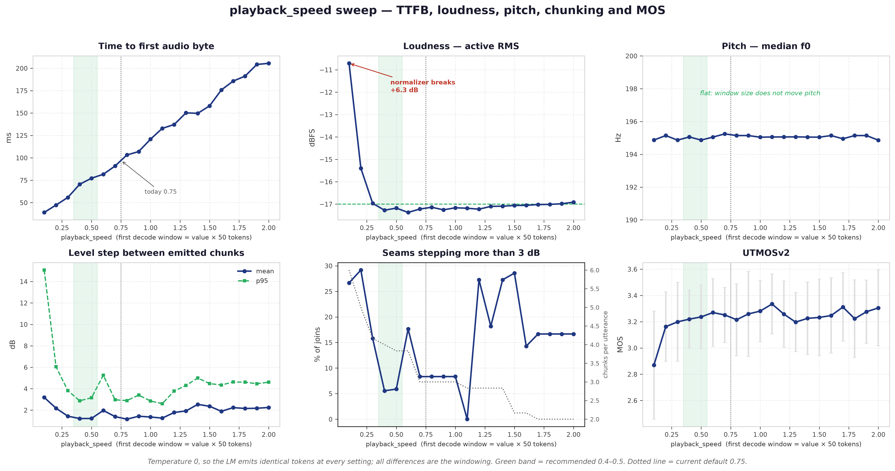
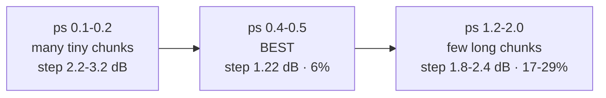

# `playback_speed` 0.1 → 2.0

**Measured 2026-09-23.** `playback_speed` sets the **first decode window** (value × 50 tokens).
That window is the TTFB gate. Everything after it grows by `STREAM_CHUNK_GROWTH`.

Temperature 0, so the LM emits identical tokens at every setting. Every difference below is the
windowing alone. 6 texts, 20 settings, reference = `playback_speed=50` (one window, no seams).



## Recommendation: **0.4**

| | today `0.75` | **`0.4`** | change |
|---|---|---|---|
| TTFB | 103 ms | **70 ms** | **−32%** |
| Loudness | −17.2 dBFS | −17.3 dBFS | none |
| Pitch | 195.1 Hz | 195.1 Hz | none |
| Chunk-to-chunk step | 1.40 dB | 1.22 dB | within noise |
| Seams over 3 dB | 8% | 6% | within noise |
| UTMOSv2 | 3.251 | 3.219 | within noise |

**0.4 buys 33 ms of TTFB at no measurable cost.** Loudness, pitch, chunk consistency and MOS are
all unchanged *within noise* — the chunk-step and MOS differences above are smaller than the
measurement spread, so read them as "not worse", not "better".

### ⚠ The catch: client buffer under load

| concurrency | `0.4` buffer | `0.75` buffer | TTFB advantage of 0.4 |
|---|---|---|---|
| 1 | 0.322 s | 0.600 s | −30% |
| 8 | 0.283 s | 0.573 s | −29% |
| **32** | **0.030 s** | 0.390 s | **−11%** |

At concurrency 32 the margin collapses to **30 ms** while the TTFB win shrinks to 11%. Zero stalls
in 20 runs at every point, but 30 ms is one scheduling hiccup from starving a caller.

**So: 0.4 if concurrency stays low. Keep 0.75 if you run near 32.** 0.5 is the hedge — 0.409 s of
buffer single-stream and still 25% faster than 0.75.

## The numbers

| ps | TTFB | RMS | f0 | chunks | chunk \|Δ\| mean | p95 | >3 dB | MOS |
|---|---|---|---|---|---|---|---|---|
| **0.1** | **39 ms** | **−10.7** 💥 | 194.9 | 6.0 | **3.19** | **15.06** | 27% | **2.869** |
| 0.2 | 47 ms | −15.4 | 195.1 | 5.0 | 2.18 | 6.05 | 29% | 3.162 |
| 0.3 | 56 ms | −17.0 | 194.9 | 4.2 | 1.44 | 3.82 | 16% | 3.199 |
| **0.4** | **70 ms** | −17.3 | 195.1 | 4.0 | **1.22** | **2.87** | **6%** | 3.219 |
| **0.5** | 77 ms | −17.2 | 194.9 | 3.8 | **1.22** | 3.15 | **6%** | 3.236 |
| 0.6 | 82 ms | −17.4 | 195.0 | 3.8 | 1.97 | 5.25 | 18% | 3.270 |
| 0.7 | 91 ms | −17.2 | 195.2 | 3.0 | 1.40 | 2.97 | 8% | 3.251 |
| 0.8 | 103 ms | −17.1 | 195.1 | 3.0 | 1.16 | 2.89 | 8% | 3.215 |
| 0.9 | 107 ms | −17.3 | 195.1 | 3.0 | 1.43 | 3.40 | 8% | 3.259 |
| 1.0 | 121 ms | −17.2 | 195.0 | 3.0 | 1.36 | 2.85 | 8% | 3.281 |
| 1.2 | 137 ms | −17.2 | 195.1 | 2.8 | 1.78 | 3.79 | 27% | 3.258 |
| 1.5 | 158 ms | −17.1 | 195.0 | 2.2 | 2.36 | 4.48 | 29% | 3.232 |
| 2.0 | 206 ms | −16.9 | 194.9 | 2.0 | 2.25 | 4.61 | 17% | 3.305 |

## Four findings

### 1. TTFB is linear in the window

39 ms at 0.1, 206 ms at 2.0. About **83 ms per unit**. No knee, no free region.

### 2. The loudness normalizer breaks below 0.3

| ps | RMS | error |
|---|---|---|
| 0.1 | −10.7 dBFS | **+6.3 dB** |
| 0.2 | −15.4 dBFS | +1.6 dB |
| ≥0.3 | −17.0 to −17.4 | none |

`STREAM_NORMALIZE` estimates its gain from the first window. At 0.1 that window is 5 tokens —
0.1 s. Too short to estimate active RMS, so it locks on nonsense and the whole utterance is
6.3 dB hot.

This is the **hard floor**. Not a quality preference.

⚠ CLAUDE.md said 0.5 "skews the loudness normalizer +1 dB". **It does not.** 0.5 measures
−17.2 dBFS against 1.0's −17.2. The real cliff is at 0.2 and below.

### 3. Pitch does not move at all

194.9 – 195.2 Hz across the whole sweep. A 0.3 Hz spread on a 195 Hz median.

Window size changes *how* the decoder sees the tokens, not *what* they are. Pitch is in the
tokens. Clean negative result — worth knowing so nobody re-tests it.

### 4. Chunk consistency is worst at **both** ends



The middle wins, and the reason differs at each end:

- **Small windows** → 5–6 chunks per utterance, some only 0.09 s long. The normalizer has too
  little to work with per chunk, and there are more seams to get wrong.
- **Large windows** → 2 chunks per utterance, each spanning more varied content. A single gain
  per chunk fits that content worse, so the two chunks land further apart.

At 1.5 it is **29% of seams over 3 dB** — worse than 0.2. Bigger windows are not safer.

## UTMOSv2

MOS runs 2.869 → 3.335 across the sweep, but the within-file noise is ±0.12–0.17. Only **0.1**
is clearly separated; everything from 0.2 up sits inside one noise band.

UTMOSv2 *did* catch the 0.1 loudness break (2.869 vs ~3.25). It did not catch the padding
corruption in `bench/PADDING_BUG.md`. It detects gross level error, not additive noise.

## Caveats

- One voice (`TM_English_Normal`), 6 texts, temperature 0. Chunk counts depend on utterance
  length, so a longer corpus shifts them.
- `>3 dB` percentages come from 15–35 seams per setting. Treat ±10 points as noise; the
  0.4–0.5 versus 1.2–2.0 gap is larger than that.
- Measured on one worker with `CUDA_GRAPH_BATCH=[]`, against a remote TP=4 engine. TTFB is
  dominated by LM generation, so a different engine shifts the whole curve up or down.

## Reproducing

```bash
python bench/ttfb_probe.py --url ... --playback 0.1,0.2,0.3,0.4,0.5 --overlap 0.2 --reps 5
python bench/window_ab.py  --url ... --configs 0.4:0.2,0.75:0.2   # envelope + seam clicks
```

Raw data: `bench/results/playback_sweep/{pb_full,pb_chunks}.json`.
