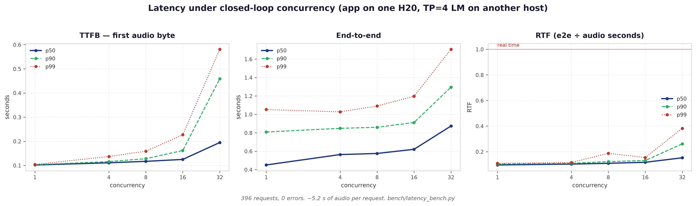
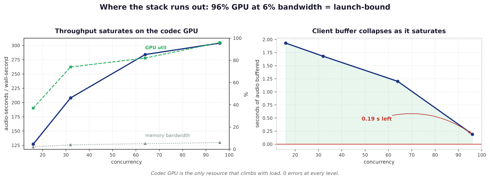

# Time to first byte and end-to-end latency

Measured **2026-09-05** against the staging deployment of this app, from a laptop over the public
internet. Every wall-clock number below therefore contains one client round trip; the
decomposition in *Where the time goes* separates that out.






## What was measured

**Hardware and topology.** Both services run on **NVIDIA H20-3e** GPUs in the `H20` cluster
(3 GPUs in total; the deployment's public hostname says "l40", which is a naming artefact, not the
hardware):

| | |
|---|---|
| LM | `Scicom-intl/Multilingual-TTS-1.7B-Base` (Qwen3-1.7B continued-pretrained to emit `<\|s_NNNN\|>` speech tokens), served by vLLM in bf16 across **2× H20-3e, tensor parallel = 2** |
| App | this FastAPI app + vendored NeuCodec on **1× H20-3e**, `uvicorn --workers 4` |
| App config | `bench/deploy/env.optimized.example` / the `tts-api` SlurmUI job: `DYNAMIC_BATCHING=true`, `MAX_BATCH_SIZE=8`, `DEFAULT_PLAYBACK_SPEED=0.75`, `DEFAULT_PLAYBACK_OVERLAP_SPEED=0.2`, `DEFAULT_NORMALIZER_MODE=llm`, `LLM_NORMALIZER_SKIP_PLAIN=true`, `LLM_NORMALIZER_RULE_FIRST=true` |
| LLM normalizer backend | `google/gemma-4-31b-it` through the serverless proxy (a network hop off this cluster) |

**Method.** `bench/ttfb_report.py` (new). Per request it times the `/v1/audio/normalize` round trip
for the same text and mode, then streams `/v1/audio/speech` with `response_format=pcm` and records
when the response **headers** arrive, when the **first non-empty audio byte** arrives, and when the
stream ends. TTFB is always taken on a `pcm` stream: a `wav` stream emits its 44-byte header before
any decode has happened, so a `wav` TTFB measures nothing. 7 texts × 3 modes × 5 repetitions,
`playback_speed=0.75`, `overlap=0.2`, temperature 0.6, one warm-up request discarded.

Texts are grouped by what the normalizer has to do with them:

- **plain** — no digits or symbols. `LLM_NORMALIZER_SKIP_PLAIN` skips the LLM outright.
- **covered** — money, dates, times, phone numbers that the rule normalizer reads completely, so
  under `LLM_NORMALIZER_RULE_FIRST` nothing is left for the LLM and the call is skipped.
- **forced** — text that still carries a symbol the rules cannot speak (`@`, `&`, `P&L`, `4.5/5`),
  so the LLM really is called. This is the only case where "rules vs LLM" diverges.

## Headline

**The LLM normalizer costs 540–1090 ms every time it runs.** The deployment is fast because two
gates stop it from running, not because the call is cheap. Read the middle and right columns as two
different things: `mode=llm` *as configured here*, and `mode=llm` with the gates off.

| | rule-based (`mode=spoken`) | `mode=llm` as deployed (gated) | if the LLM actually runs |
|---|---|---|---|
| TTFB, plain text | **234 ms** | 235 ms — LLM skipped by `SKIP_PLAIN` | ~770 ms |
| TTFB, numbers the rules cover | **237 ms** | 237 ms — LLM skipped by `RULE_FIRST` | ~940 ms |
| TTFB, symbol the rules cannot speak | **240 ms** | **873 ms** — LLM runs | 873 ms |
| End-to-end, 9–11 s of audio | 1.7–2.0 s | 1.9–2.4 s | +0.6–1.1 s on top |
| Real-time factor | 0.16–0.23 | 0.16–0.30 | worse by the same amount |

Two separate facts, and the second one is the surprising one:

1. **An LLM call costs 540–1090 ms.** Measured directly against the same model and proxy the app
   uses, below.
2. **On this deployment it is made on 1 request in 497.** `LLM_NORMALIZER_SKIP_PLAIN` drops it for
   text with nothing to normalize, and `LLM_NORMALIZER_RULE_FIRST` runs the rule normalizer first
   and only calls the LLM if a digit or symbol survives that pass. Together they take the round
   trip off 99.8% of the corpus.

Turn both gates off and every request pays the middle column's right-hand price. That is what the
deployment looked like before 2026-09-04, and it is what a differently configured instance will
still do.

## Rules vs LLM, in detail

Medians over 5 repetitions. `normalize` is the isolated `/v1/audio/normalize` round trip for the
same text; because the normalizer runs before the LM prompt is built, its cost is TTFB one-for-one.

| text | mode | normalize | TTFB | end-to-end | audio | RTF |
|---|---|---|---|---|---|---|
| plain, English | spoken | 123 ms | 233 ms | 0.65 s | 2.80 s | 0.22 |
| plain, English | llm | 124 ms | 239 ms | 0.71 s | 2.86 s | 0.25 |
| plain, Malay | spoken | 123 ms | 235 ms | 0.81 s | 3.56 s | 0.23 |
| plain, Malay | llm | 123 ms | 232 ms | 0.81 s | 3.62 s | 0.22 |
| covered, English | spoken | 123 ms | 233 ms | 1.98 s | 11.02 s | 0.18 |
| covered, English | llm | 126 ms | 235 ms | 1.98 s | 11.04 s | 0.18 |
| covered, Malay | spoken | 124 ms | 238 ms | 1.74 s | 10.22 s | 0.17 |
| covered, Malay | llm | 125 ms | 237 ms | 1.91 s | 10.48 s | 0.19 |
| **forced, English** | **spoken** | **127 ms** | **239 ms** | **1.63 s** | 8.36 s | 0.20 |
| **forced, English** | **llm** | **751 ms** | **856 ms** | **2.37 s** | 9.10 s | 0.27 |
| **forced, Malay** | **spoken** | **127 ms** | **241 ms** | **1.52 s** | 7.64 s | 0.20 |
| **forced, Malay** | **llm** | **758 ms** | **875 ms** | **2.16 s** | 7.10 s | 0.30 |
| long, English (3 sentences) | spoken | 126 ms | 237 ms | 3.77 s | 24.16 s | 0.16 |
| long, English (3 sentences) | llm | 125 ms | 252 ms | 3.85 s | 24.02 s | 0.16 |

The LLM penalty lands in end-to-end latency as well, not just TTFB: on the forced texts the whole
request takes 0.6–0.7 s longer for the same amount of audio, which is why RTF rises from 0.20 to
0.27–0.30 there.

**How often does the penalty apply?** Over the 497-sentence normalizer corpus
(`bench/normalizer_corpus.py`), with `SKIP_PLAIN` and `RULE_FIRST` both on:

| | sentences | share |
|---|---|---|
| plain, LLM skipped by the gate | 21 | 4.2% |
| rules read everything, LLM call skipped | 475 | 95.6% |
| LLM actually called | 1 | 0.2% |

So on realistic traffic the deployed `mode=llm` behaves like the rule path **99.8%** of the time.
The 633 ms is what a request costs when it falls through, not an average — and the average is low
only because of the gates, not because the call is fast.

## What the LLM call itself costs

`llm_normalize()` called directly against the same model and proxy the app uses, 3 repetitions,
median. The "gate" column says which of the two gates would stop this call on the deployment:

| text | gate | LLM round trip | on the deployment |
|---|---|---|---|
| plain, English | `SKIP_PLAIN` | 538 ms | not called |
| plain, Malay | `SKIP_PLAIN` | 536 ms | not called |
| numbers, English | `RULE_FIRST` | 700 ms | not called |
| numbers, Malay | `RULE_FIRST` | 735 ms | not called |
| symbol the rules cannot speak | none | 640 ms | **called, paid in full** |
| 3 sentences, English | `RULE_FIRST` | 1090 ms | not called |

The call scales with output length, which is why the three-sentence text costs over a second: the
model has to emit the whole normalized text. This is the cost the gates remove, and it is why the
`mode=llm` column in the headline is not evidence that the LLM is cheap.

## Where the time goes

The response headers are sent after normalization but before the first decode, so the two stages
separate cleanly in-band. Medians across all 21 text × mode cells:

| Stage | Time | Evidence |
|---|---|---|
| Client → service and back (plumbing) | ~125 ms | headers arrive at 124–126 ms; a bare `GET /docs` round trip is 141 ms |
| Normalizer, rules only | ~0 ms | headers arrive at the same 125 ms as the plumbing baseline |
| Normalizer, LLM actually called | **+633 ms** | headers slip from 126 ms to 759 ms; the isolated normalize call goes 127 ms → 754 ms |
| LM first window + first codec decode + emit, on the H20-3e pair | **109–114 ms** | first audio byte minus headers, constant in every mode and text kind |

That last row is the on-box TTFB floor and it is remarkably stable: 109, 111, 113, 113, 114 ms
across the seven texts and three modes. At `playback_speed=0.75` + `overlap=0.2` the stitcher waits
for `(0.75 + 0.2) × 50 ≈ 48` speech tokens before the first decode, so ~113 ms covers prefill, ~48
tokens of autoregressive generation on the two H20-3e cards and one codec decode on the third.

**For a client on the same network as the service, TTFB is therefore ~115 ms on the rule path**
and ~750 ms on a request that reaches the LLM.

## First decode window: the other TTFB knob

`playback_speed` sets the size of the **first** decode window only (later windows grow ×2 up to
`STREAM_MAX_CHUNK_S`), and that gate is the whole on-box TTFB. Swept with `mode=spoken`, 4
repetitions each, same text:

| `playback_speed` | tokens waited for | TTFB (wall) | TTFB minus plumbing |
|---|---|---|---|
| 2.0 | 110 | 361 ms | ~236 ms |
| 1.5 | 85 | 328 ms | ~203 ms |
| 1.0 | 60 | 300 ms | ~175 ms |
| **0.75** (deployed) | **48** | **240 ms** | **~115 ms** |
| 0.5 | 35 | 217 ms | ~92 ms |

0.75 is the deployed value; `bench/window_ab.py` established earlier that it is
output-equivalent to a one-shot decode (envelope median |Δ| 0.11 dB, transcripts identical 7/7)
while 0.5 biases the loudness normalizer by +1 dB. This sweep reproduces the latency side of that
choice and adds nothing to contradict it.

## End-to-end latency under concurrency

Same text (~9–10 s of audio), `mode=spoken`, three waves per level:

| Concurrency | TTFB p50 | TTFB p90 | End-to-end p50 | End-to-end p90 | RTF p50 | Throughput |
|---|---|---|---|---|---|---|
| 1 | 236 ms | 239 ms | 1.72 s | 1.89 s | 0.18 | 5.8 audio-s / wall-s |
| 4 | 276 ms | 417 ms | 1.90 s | 2.44 s | 0.21 | 16.6 audio-s / wall-s |
| 8 | 276 ms | 409 ms | 1.94 s | 2.13 s | 0.21 | 34.2 audio-s / wall-s |

(One H20-3e is running the codec for all of this, with 4 uvicorn workers sharing it.)

TTFB grows by ~40 ms from 1 to 8 concurrent requests and end-to-end by ~0.2 s, while throughput
scales close to linearly. This was a deliberately light probe against a shared deployment, not a
saturation test; `bench/OPTIMIZATION.md` has the saturation curves.

## A correctness note on the word "rules"

Two different rule paths exist and only one is safe to call "the rule-based normalizer":

| mode | what it is | same text, same request |
|---|---|---|
| `spoken` | `app/spoken_normalizer`, the rule-based replica of the LLM normalizer | "one thousand two hundred fifty ringgit **fifty sen** as of **the fifteenth of March twenty twenty-four**" |
| `rule` | the legacy Malaysian pipeline (`app/normalizer`, `app/rules.py`) | "one thousand, two hundred and fifty ringgit**. five zero** as of fifteen March two thousand and twenty four" |

`mode=rule` is as fast as `mode=spoken` (it is also local), but it reads `RM1,250.50` as
"ringgit. five zero" — it drops the cents and emits a sentence-ending period mid-utterance. It was
measured here only to keep the comparison honest; it is not the path to deploy. In one earlier
probe it also took 2.3 s on its first call.

## Reproducing

```bash
uv run --with aiohttp python bench/ttfb_report.py --url http://<host>:9091 \
    --voice TM_English_Normal --reps 5 --out /tmp/ttfb_report.json      # TTFB + e2e per mode
uv run --with aiohttp python bench/ttfb_probe.py --url http://<host>:9091 \
    --mode spoken --playback 2.0,1.5,1.0,0.75,0.5 --overlap 0.2 --reps 4   # first-window sweep
PYTHONPATH=. python3 -c "                                               # how often the LLM is called
from app.spoken_normalizer import normalize as sp
from app.llm_normalizer import has_unspoken, needs_normalization
import sys; sys.path.insert(0,'bench')
from normalizer_corpus import CORPUS
print(sum(1 for c in CORPUS if needs_normalization(c[3]) and has_unspoken(sp(c[3]))), 'of', len(CORPUS))"
```

## Caveats

- Every wall-clock figure includes ~125 ms of client round trip. The *Where the time goes* section
  is the number to quote for a co-located caller.
- `min_lead_s` (the client-stall margin that `ttfb_probe.py` reports) is not meaningful from off
  the box: chunk arrival over the public internet is bursty enough to show phantom negative leads
  at `playback_speed` 1.0 and 1.5 while 0.75 and 0.5 showed none. Judge underrun risk on-box.
- Audio duration varies run to run because generation is sampled at temperature 0.6, so end-to-end
  latency is only comparable through RTF, not in absolute seconds.
- Whether this deployment has CUDA graphs enabled could not be verified remotely; the deploy
  example sets `CUDA_GRAPH_BATCH=[0.5,1.0,1.5,2.0,3.0,4.0]` while the SlurmUI job ships `[]`
  (eager). The difference is ~7 ms vs ~17 ms for the first decode, inside the noise of the ~113 ms
  post-header figure either way.
- The LLM normalizer's 633 ms is a round trip to a model on another cluster through a proxy; it
  will move with that proxy's load and is not a property of this app.

---

# Update 2026-09-21 — the split-box deployment (app + remote TP=4 engine)

A second deployment measured on-box against `127.0.0.1`, so unlike everything above there is
**no client round trip in these numbers**. Topology is different too, and that is the point:
the app runs on one H20 (GPU 7, 4 uvicorn workers, eager decode, `MAX_BATCH_SIZE=8`,
`DEFAULT_PLAYBACK_SPEED=0.75`, normalizer `llm` + `SKIP_PLAIN` + `RULE_FIRST`) while the LM is
a **TP=4 vLLM on a different host**. The codec GPU therefore contends with nothing.

Tool: `bench/latency_bench.py` — written for this because `bench/bench.py` requests
`response_format=wav`, and a wav response emits its 44-byte header before a single token is
decoded, so its "TTFB" measures the header and reads ~0 whatever the stack is doing. This one
streams `pcm`, where the first byte IS audio, and reports p10/p95/p99.

## TTFB — first audio byte, seconds

| conc | mean | p10 | p50 | p90 | p95 | p99 | max |
|---|---|---|---|---|---|---|---|
| 1 | 0.102 | 0.101 | **0.102** | 0.103 | 0.104 | 0.104 | 0.104 |
| 4 | 0.113 | 0.109 | 0.111 | 0.116 | 0.128 | 0.137 | 0.137 |
| 8 | 0.120 | 0.115 | 0.117 | 0.128 | 0.141 | 0.159 | 0.159 |
| 16 | 0.136 | 0.121 | 0.125 | 0.162 | 0.187 | 0.227 | 0.227 |
| 32 | 0.253 | 0.139 | **0.195** | 0.459 | **0.489** | 0.581 | 0.668 |

## End-to-end and RTF (~5.2 s of audio per request)

| conc | e2e p50 | e2e p95 | RTF p50 | RTF p95 | audio-s/wall-s | req/s | min client lead | errors |
|---|---|---|---|---|---|---|---|---|
| 1 | 0.451 | 0.971 | 0.096 | 0.108 | 10.4 | 2.0 | 1.87 s | 0 |
| 4 | 0.564 | 0.959 | 0.103 | 0.114 | 36.3 | 7.0 | 1.84 s | 0 |
| 8 | 0.576 | 1.050 | 0.109 | 0.127 | 65.9 | 12.4 | 1.89 s | 0 |
| 16 | 0.621 | 1.152 | 0.117 | 0.144 | 123.7 | 23.6 | 1.76 s | 0 |
| 32 | 0.874 | 1.372 | 0.152 | 0.292 | **181.7** | 34.2 | 1.36 s | 0 |

396 requests, **0 errors, 0 stalls**. For scale, the CLAUDE.md table's best is 83.9 audio-s/s at
concurrency 50 on one H100 with CUDA graphs + MPS; this is 2.2× that at lower concurrency with
**eager** decode, because the LM is off the box and the codec GPU contends with nothing.

## Where the 102 ms goes (`bench/lm_probe.py` against the same engine)

| stage | time | share |
|---|---|---|
| prefill + scheduling (`t_first_token`) | 9 ms | 9% |
| **generating the first window** (47 tokens @ 557 tok/s) | **90 ms** | **88%** |
| codec decode + stitcher + HTTP | ~12 ms | 12% |

The first window is `playback_speed*50 + overlap*50` = 0.75×50 + 0.2×50 ≈ 47 tokens, and
`lm_probe` puts token 47 on the wire at 90 ms. **Autoregressive decode is ~88% of TTFB**, which
is where any further TTFB work has to aim.

### The TP sweep — measured 2026-09-22, and it refuted the guess that prompted it

This section previously carried a warning that 557 tok/s on TP=4 looked "suspicious", reasoning
that a 3.4 GB model against ~4 TB/s of HBM should decode nearer 1000 tok/s on a single card, and
that four H20s buying only 5% over prod's TP=2 meant the all-reduce was costing more than it
returned. **All of that was wrong.** The sweep, run on one node with one client so the arms are
actually comparable:

| TP | GPUs | tok/s | token 47 arrives | TTFB p50 (c=1) | TTFB p50 (c=8) | RTF p50 (c=8) |
|---|---|---|---|---|---|---|
| 1 | 4 | **469** | 0.107 s | 0.119 s | 0.134 s | 0.127 |
| 2 | 4,5 | **498** | 0.102 s | 0.113 s | 0.120 s | 0.110 |
| **4** | 4–7 | **557** | 0.090 s | **0.102 s** | 0.117 s | 0.109 |

**TP=4 is the fastest of the three and the right setting.** TP=1 is 16% slower, not faster. The
"5%" figure came from comparing against prod's ~530 tok/s on a *different node with different
co-tenants* — an invalid comparison; on the same node TP=2 is 498, so TP=4 buys 11.8%. And the
bandwidth ceiling was the wrong model entirely, as the next paragraph shows. There is no free
win here: the sweep is done, and re-running it is only worth it if the hardware changes.

### Why it is slow, measured rather than reasoned

Sampling all eight GPUs on the engine node while driving batch-1 decode:

| GPU | role | util | **memory-bandwidth util** |
|---|---|---|---|
| 0–3 | STT engine (separate tenant) | 0% | 0% |
| 4 | TTS rank 0 | 98.1% | 13.9% |
| 5 | TTS rank 1 | 98.3% | 13.8% |
| 6 | TTS rank 2 | 98.0% | 13.8% |
| 7 | TTS rank 3 (+ the 1020 API jobs) | 98.3% | 13.8% |

Two hypotheses die here. **It is not rank contention** — rank 3 shares its GPU with `tts-api-1020`
and `stt-api-1020`, and in TP every token ends at a barrier so one slow rank would gate the step,
but rank 3 reads 98.3% against rank 0's 98.1% and the STT engine is completely idle. **And the
ranks are not idling on all-reduce** — they are pegged at 98% occupancy.

What they are *not* doing is moving data: **14% of memory bandwidth**. Busy essentially all the
time while moving almost nothing is the signature of many tiny kernels per token — launch- and
sync-bound, not bandwidth-bound. That also explains the shape of the sweep: TP helps because it
shrinks each rank's slice, and the gains decay because the fixed per-kernel overhead does not
shrink with it.

This is the regime a **megakernel** targets — fusing the forward pass into one persistent kernel
removes exactly the per-launch and inter-op cost that 98%-occupancy-at-14%-bandwidth is made of.
Note that this contradicts the advice further down about the codec, which is a different claim
about a different component: for the codec, CUDA graphs are the unpulled lever and capture most
of the same win for an env var. For the **LM**, this measurement is the best support there is for
a fused kernel, and TP=1 is the configuration it would have to be built on (published megakernel
work is single-GPU; fusing cross-rank collectives is research).

## Through a real LiveKit agent + WebRTC (same box, `bench/livekit/`)

`TTS_INTERLEAVE=false`, i.e. prod parity — the openai plugin sends no interleave id.

| conc | utterances | mean | p10 | p50 | p90 | p95 | max |
|---|---|---|---|---|---|---|---|
| 1 | 12 | 0.248 | 0.183 | **0.225** | 0.267 | 0.555 | 0.555 |
| 4 | 48 | 0.253 | 0.171 | **0.236** | 0.342 | 0.521 | 0.656 |
| 8 | 84 | 0.280 | 0.202 | **0.237** | 0.551 | 0.587 | 0.649 |

**The chain, and it accounts for what prod reports:**

| | TTFB p50 |
|---|---|
| API direct, on-box | **102 ms** |
| + LiveKit agent + WebRTC | **225–237 ms** (LiveKit adds ~130 ms) |
| a prod agent trace, 2026-09-21 | **324 ms** (a further ~90 ms: agent not colocated, busier box) |

Two things this says. **The split-box deployment halved the LiveKit-path TTFB** — the same rig on
the previous stack (local TP=1 engine) measured p50 462 ms on 2026-09-18, against 225 ms here.
And **LiveKit fattens the tail far more than the median**: p95/p50 is ~1.15× through the API and
**2.2–2.5×** through the agent. The median is healthy; the occasional lag a caller hears is the
agent path, not synthesis.

## Is the codec the thing to optimise? (sampled during a concurrency-32 load)

| | |
|---|---|
| GPU 7 (codec) | mean 61%, median 72%, max 84% |
| app CPU, 4 uvicorn workers | 185% of 400% available |

The codec GPU is the busier of the two — which **contradicts** the H100 finding above that the
GPU idles while one core pins. That finding was measured with CUDA graphs on; this deployment
runs `CUDA_GRAPH_BATCH="[]"`, so the GPU is at 72% doing the work the slow way. Enabling CUDA
graphs (~1.7× on the codec, CLAUDE.md) should take it to ~42% and hand the constraint back to
the CPU, exactly as the older measurement predicts. A fused/megakernel codec attacks the same
dominant cost a CUDA graph does — per-launch overhead — for weeks of work instead of an env var,
and lands on a resource that would no longer bind. The 4 uvicorn workers are the real ceiling.

## Reproducing the update

```bash
python bench/latency_bench.py --url http://127.0.0.1:9091 --voice TM_English_Normal \
  --concurrency 1,4,8,16,32 --out latency.json
set -a; source /etc/profile.d/aura.sh; set +a          # VLLM_AUTH_KEY for the engine
TTS_API=http://<engine>:9093 python bench/lm_probe.py --voice TM_English_Normal --gates 37,47,60,85
python bench/livekit/load_client.py --concurrency 4 --utterances 12 --texts bench/pitch_stress_texts.txt
```

Raw JSON: `bench/results/latency-2026-09-21/`.
